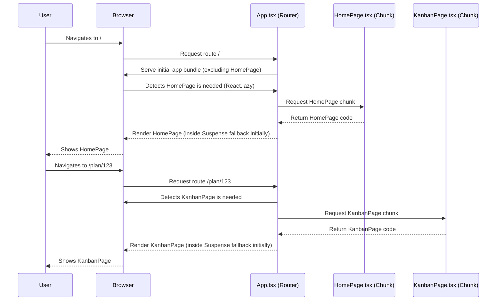

# PRD: Client Application Refactoring & Optimization

🧠 Planning documents standards rule loaded!

## 1. Overview

- **Context & Goals**:
  - The `client` application, built with React, Vite, and TypeScript, requires a refactoring phase to enhance performance, maintainability, and overall code quality.
  - This refactoring aims to identify and implement optimizations across various aspects of the frontend codebase.
  - The primary goal is to ensure the application is scalable, efficient, and provides a smooth user experience.
- **Current Pain Points** (Assumed based on general frontend best practices):
  - Potential for unoptimized bundle sizes leading to slower initial load times.
  - Possibility of inefficient component rendering patterns affecting runtime performance.
  - Opportunities to improve code structure for better long-term maintainability.
  - Need to ensure state management practices are optimal and scale effectively.

## 2. Proposed Solution

- **High-level Summary**:
  - Conduct a thorough analysis of the existing `client` codebase to pinpoint specific areas for optimization.
  - Implement targeted refactoring for code splitting, component performance, state management, and bundle size reduction.
  - Establish clear metrics to measure the impact of optimizations.
  - Ensure comprehensive testing throughout the refactoring process.
- **Architecture & Directory Structure** (Existing, for context):
  ```
  client/
  ├── src/
  │   ├── components/       # UI components (common, home, kanban, layout, plans)
  │   ├── hooks/            # Custom React hooks
  │   ├── lib/              # Utility functions, external library configurations
  │   ├── pages/            # Page-level components
  │   ├── store/            # Zustand state management
  │   ├── types/            # TypeScript type definitions
  │   ├── App.tsx           # Main application component with routing
  │   ├── main.tsx          # Application entry point
  │   └── index.css         # Global styles
  ├── public/             # Static assets
  ├── package.json
  ├── vite.config.ts
  └── tsconfig.json
  ```
  No major directory structure changes are proposed initially, but specific modules or components might be reorganized if significant benefits are identified during the detailed analysis phase.

## 3. Implementation Plan

- **Phase 1: Analysis & Detailed Planning (1 day)**

  1.  **Task 1.1: Bundle Analysis**:
      - Integrate `rollup-plugin-visualizer` or a similar tool.
      - Generate and analyze the production bundle report to identify large modules/dependencies.
      - _Validation_: Bundle report available and key contributors to size documented.
  2.  **Task 1.2: Performance Profiling (Initial)**:
      - Use React DevTools Profiler and browser performance tools to identify slow-rendering components and JavaScript bottlenecks in key user flows (e.g., navigating to KanbanPage, interacting with tasks).
      - _Validation_: Profiling reports documented for at least 2 key user flows.
  3.  **Task 1.3: Code Structure Review**:
      - Review component structure, prop drilling, context usage, and Zustand store organization.
      - Identify opportunities for better modularity, memoization, and optimized selectors.
      - _Validation_: Documented list of 3-5 specific components/modules for refactoring with rationale.
  4.  **Task 1.4: Define Optimization Metrics**:
      - Establish baseline metrics for key performance indicators (KPIs) such as Lighthouse scores (Performance, Best Practices, Accessibility), initial load time (e.g., Largest Contentful Paint), and bundle size.
      - _Validation_: Spreadsheet/document with baseline KPIs recorded.

- **Phase 2: Core Optimizations (3 days)**

  1.  **Task 2.1: Implement Route-based Code Splitting**:
      - Refactor `App.tsx` to use `React.lazy` and `Suspense` for `HomePage` and `KanbanPage` (and other top-level routes if any).
      - _Validation_: Pages are lazy-loaded; verify with network tab and bundle analysis. Initial load bundle size reduction measured.
  2.  **Task 2.2: Component-Level Optimizations**:
      - Apply `React.memo`, `useMemo`, `useCallback` to components identified in Task 1.3.
      - Optimize expensive computations or effects.
      - Address issues found with `TaskDetails` component if it's always rendered.
      - _Validation_: React DevTools Profiler shows improved rendering times for targeted components. No visual regressions.
  3.  **Task 2.3: State Management Refinements (Zustand)**:
      - Optimize Zustand store selectors if inefficiencies are found.
      - Ensure state is appropriately scoped (global vs. local vs. context).
      - _Validation_: Components re-render only when relevant parts of the Zustand state change.
  4.  **Task 2.4: Review `lucide-react` `optimizeDeps` exclusion**:
      - Test impact of including `lucide-react` in `optimizeDeps` on cold start and dev server performance.
      - _Validation_: Decision documented with supporting evidence (e.g., startup time comparison).

- **Phase 3: Advanced Optimizations & Asset Review (2 days)**

  1.  **Task 3.1: Tree Shaking & Dependency Pruning**:
      - Review dependencies from Task 1.1. If large unused portions of libraries are included, explore alternatives or more targeted imports.
      - Ensure Vite/Rollup tree-shaking is effective.
      - _Validation_: Bundle size reduction measured.
  2.  **Task 3.2: Static Asset Optimization**:
      - Review any images, custom fonts, or other large static assets.
      - Implement compression, appropriate formats (e.g., WebP for images), and lazy loading for offscreen images.
      - _Validation_: Assets are optimized; Lighthouse score for image optimization improves if applicable.
  3.  **Task 3.3: Accessibility (A11y) Audit & Fixes**:
      - Run automated accessibility checks (e.g., Axe DevTools).
      - Manually review keyboard navigation and ARIA attribute usage for key components.
      - Implement fixes for identified a11y issues.
      - _Validation_: Lighthouse accessibility score improves; major a11y issues resolved.

- **Phase 4: Testing & Final Validation (1.5 days)**
  1.  **Task 4.1: Integration Testing**:
      - Write/update integration tests (Vitest) for key user flows affected by refactoring.
      - _Validation_: Test suite passes; coverage for refactored areas maintained or increased.
  2.  **Task 4.2: Regression Testing**:
      - Thoroughly manually test the application across supported browsers, focusing on refactored areas.
      - _Validation_: No functional or visual regressions identified.
  3.  **Task 4.3: Performance Metrics Re-evaluation**:
      - Re-measure KPIs defined in Task 1.4 (Lighthouse, load times, bundle size).
      - _Validation_: Documented comparison of before/after KPIs, showing improvements.
  4.  **Task 4.4: Documentation Update**:
      - Update any READMEs, comments, or internal documentation affected by the changes.
      - _Validation_: Relevant documentation is current.

## 4. File and Directory Structures

(As listed in Section 2. No changes anticipated unless Task 1.3 reveals strong reasons for it)

## 5. Technical Details (Examples of potential changes)

- **Lazy Loading Routes (`client/src/App.tsx`)**:

  ```typescript
  // Before
  // import { HomePage } from './pages/HomePage';
  // import { KanbanPage } from './pages/KanbanPage';

  // After
  const HomePage = React.lazy(() => import('./pages/HomePage'));
  const KanbanPage = React.lazy(() => import('./pages/KanbanPage'));

  // In <Routes>
  // <Route index element={<React.Suspense fallback={<>Loading...</>}><HomePage /></React.Suspense>} />
  // <Route path="plan/:planId" element={<React.Suspense fallback={<>Loading...</>}><KanbanPage /></React.Suspense>} />
  ```

- **Memoizing a Component (`client/src/components/common/SomeItem.tsx`)**:

  ```typescript
  // interface SomeItemProps { data: HeavyDataObject; }
  // const SomeItem: React.FC<SomeItemProps> = ({ data }) => {
  //   // ... expensive rendering logic ...
  //   return <div>{data.name}</div>;
  // };
  // export default SomeItem;

  // After
  // import React from 'react';
  // interface SomeItemProps { data: HeavyDataObject; }
  // const SomeItem: React.FC<SomeItemProps> = React.memo(({ data }) => {
  //   // ... expensive rendering logic ...
  //   return <div>{data.name}</div>;
  // });
  // export default SomeItem;
  ```

## 6. Usage Examples

N/A for a refactoring PRD, as the external API/usage of the application is not intended to change. The primary impact is on performance and maintainability.

## 7. Testing Strategy

- **Unit Tests**:
  - Review and enhance existing Vitest unit tests for components undergoing significant refactoring.
  - Ensure utility functions created/modified during refactoring have unit tests.
  - Test Zustand store selectors for correctness.
- **Integration Tests**:
  - Focus on user flows that cover lazy-loaded pages.
  - Verify that components with performance optimizations still integrate correctly.
  - Test data fetching and display in refactored areas.

## 8. Edge Cases

| Edge Case                                        | Remediation                                                                                        |
| :----------------------------------------------- | :------------------------------------------------------------------------------------------------- |
| Slow network conditions                          | Lazy loading and bundle optimization should improve user experience. Test with network throttling. |
| Older browsers/devices (if officially supported) | Verify critical path functionality. Optimizations are generally beneficial.                        |
| Unexpected data shapes from API                  | Ensure robust error handling and type safety (already using TypeScript).                           |
| `TaskDetails` component interactions             | Ensure its state and visibility logic are sound after any optimizations.                           |

## 9. Sequence Diagram (Illustrating Lazy Loading)



## 10. Risks & Mitigations

| Risk                                       | Mitigation                                                                     |
| :----------------------------------------- | :----------------------------------------------------------------------------- |
| Introduction of regressions                | Comprehensive testing (unit, integration, manual). Phased rollout if possible. |
| Performance optimizations yield no benefit | Profile before and after. Revert changes if no measurable improvement.         |
| Increased build complexity                 | Vite handles lazy loading well. Monitor build times.                           |
| Time estimation too optimistic             | Prioritize high-impact optimizations. Communicate delays proactively.          |

## 11. Timeline

- **Phase 1: Analysis & Detailed Planning**: 1 day
- **Phase 2: Core Optimizations**: 3 days
- **Phase 3: Advanced Optimizations & Asset Review**: 2 days
- **Phase 4: Testing & Final Validation**: 1.5 days
- **Total Estimated Time**: 7.5 days

## 12. Acceptance Criteria

- Lighthouse Performance score improved by at least 10 points (or to >90).
- Initial JS bundle size for the main entry point reduced by at least 15%.
- Key user flows (e.g., loading KanbanPage) feel subjectively faster and show improved metrics in React DevTools Profiler.
- No functional regressions introduced in refactored areas.
- Accessibility (Lighthouse) score is maintained or improved (target >90).
- All PRD tasks marked as completed with their validation criteria met.
- Refactoring changes are documented where necessary.

## 13. Conclusion

This refactoring and optimization plan aims to significantly improve the `client` application's performance, maintainability, and code quality. By systematically analyzing, implementing, and validating these changes, we can ensure a more robust and efficient frontend that provides a better user experience and is easier to evolve in the future.

## 14. Assumptions & Dependencies

- Access to React DevTools Profiler, browser performance tools.
- Ability to install `rollup-plugin-visualizer` or similar for bundle analysis.
- Existing test suite (Vitest) can be run and extended.
- Backend API (`http://localhost:3000`) is stable and available for testing integration points.
- The current technology stack (React, Vite, Zustand, Tailwind) remains the same.
