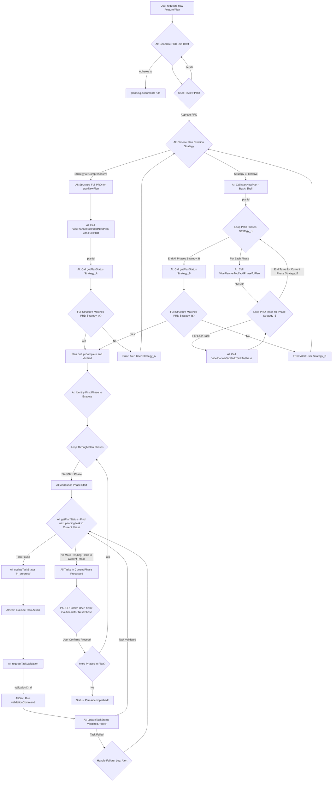

# AI Guide: Orchestrating Development with MCP Tools

This guide outlines how an AI agent can manage and drive development workflows using the VibePlannerTool's Model Context Protocol (MCP) interface. It covers starting new plans (PRDs), resuming existing ones, and the full lifecycle of task execution, incorporating mandatory pauses for human validation between phases.

## Core Concept: Human Validation Between Phases

A critical aspect of this workflow is a **mandatory pause for human review and approval** after all tasks within a given phase are completed and validated. The AI must inform the user of phase completion and explicitly wait for user confirmation (a go-ahead) before initiating any tasks in the subsequent phase. This ensures human oversight at key milestones.

## Use Case 1: Starting a New PRD from Scratch

This use case covers the scenario where a new feature, component, or project requires the creation of a new Product Requirements Document (PRD) and its corresponding development plan in the VibePlannerTool.

### 1.1. PRD Initiation & Approval (AI-Assisted)

1.  **User Request**: The process begins when a user requests the creation of a new plan/PRD.
2.  **PRD Generation (.md file)**:
    - The AI, guided by the standards in `.cursorrules/planning-documents`, assists in or generates the initial PRD content.
    - This Markdown (`.md`) file defines the plan's name, description, and critically, the detailed **phases and all tasks** within each phase.
3.  **User Review & Confirmation**:
    - The generated PRD (`.md` file) is presented to the user for review.
    - **Iterate**: If the user requests changes, the AI refines the PRD content. This cycle repeats until the user is satisfied.
    - **Proceed**: Once the user approves the PRD `.md` file.

### 1.2. Plan Creation in VibePlannerTool

Once the PRD `.md` is approved, the AI translates it into the `VibePlannerTool`. Two main strategies exist:

**Strategy A: Comprehensive `startNewPlan`**

- **Preparation**: The AI structures all information from the PRD (plan name, description, all phases with their details, and all tasks within those phases) into a format `VibePlannerTool/startNewPlan` can ingest.
  - _Assumption_: `startNewPlan` can process a comprehensive data structure for the entire plan hierarchy.
- **Execution**: Call `VibePlannerTool/startNewPlan` with the comprehensive structured data.
  - **Returns**: `{ planId, firstTask? }`.
- **Verification**: Call `VibePlannerTool/getPlanStatus` with the `planId`. Compare the reported structure against the PRD. If mismatched, alert the user and consider Strategy B or PRD format adjustments.

**Strategy B: Iterative Creation (if Strategy A fails or is not supported)**

- **Initial Plan Shell**: Call `VibePlannerTool/startNewPlan` with basic plan details (name, description).
  - **Returns**: `{ planId }`.
- **Iterate Through PRD Phases**: For each phase in the PRD:
  - Call `VibePlannerTool/addPhaseToPlan` (using `planId` and phase details from PRD).
  - **Returns**: `{ phaseId, ... }`.
  - **Iterate Through PRD Tasks (for current phase)**: For each task in the current PRD phase:
    - Call `VibePlannerTool/addTaskToPhase` (using `phaseId` and task details from PRD).
- **Overall Verification**: After all iterative additions, call `VibePlannerTool/getPlanStatus`. Compare against PRD. If mismatched, alert user and debug iterative steps.

If Strategy A is successful and verified, the plan is ready. If Strategy B is used and verified, the plan is ready.

### 1.3. Workflow Diagram for Starting a New PRD

### 1.3. Phase-by-Phase Execution (Full Cycle)

Once the plan is successfully created and verified in VibePlannerTool:

1.  **Identify Current/Next Phase**: The AI determines the first phase of the plan (e.g., based on `sequenceOrder` from `getPlanStatus` or the PRD).
2.  **Phase Loop**: For each phase in the plan:
    - **Announce Phase Start**: Inform the user, "Starting Phase: [Phase Name]".
    - **Task Loop (within current phase)**:
      - The AI consults `VibePlannerTool/getPlanStatus` to identify pending tasks for the _current active phase_.
      - If a pending task is found in the current phase:
        - Let this be `currentTask`.
        - Call `VibePlannerTool/updateTaskStatus` for `currentTask.id` to `in_progress`.
        - AI/Developer executes `currentTask`.
        - Call `VibePlannerTool/requestTaskValidation` for `currentTask.id`.
        - If `validationCommand` exists, AI/Developer runs it.
        - Call `VibePlannerTool/updateTaskStatus` for `currentTask.id` with results (`validated`, `failed`, details).
        - If `failed`, log details, alert user, and decide on re-attempt or marking as blocked. Loop back to identify next pending task in _this phase_.
        - If `validated`, loop back to identify next pending task in _this phase_.
      - If no more pending tasks are found for the _current active phase_ (i.e., all tasks in this phase are `validated`, `completed`, `failed`, `blocked`, or `cancelled`):
        - Proceed to "Human Phase Validation".
    - **Human Phase Validation**:
      - AI announces: "Phase '[Phase Name]' is complete. All tasks processed. Awaiting human validation and approval to proceed to the next phase."
      - **PAUSE**: The AI takes no further action on this plan until explicit user confirmation.
      - User reviews the completed phase and provides a go-ahead.
    - **Post-Validation**:
      - If user approves and more phases exist (determined from `getPlanStatus` or PRD): Identify and move to the next phase. Repeat Step 2 (Phase Loop).
      - If user approves and no more phases exist: The entire plan is accomplished. Announce: "Plan '[Plan Name]' fully accomplished!". End of workflow for this plan.
      - If user does not approve: The plan remains paused at this state. The AI may await further instructions or clarification.

## Use Case 2: Resuming an Existing PRD

This applies when a PRD/plan (`planId`) already exists in `VibePlannerTool`.

### 2.1. Plan State Retrieval

1.  **Obtain `planId`**: The AI is provided with the `planId` of the plan to resume.
2.  **Fetch Current State**: Call `VibePlannerTool/getPlanStatus` using the `planId`. This returns the plan's details, including all phases and the status of all their tasks.

### 2.2. Determine Resumption Point

1.  **Analyze Plan Status**: The AI examines the data from `getPlanStatus`.
2.  **Identify Active/Next Phase**:
    - Look for a phase with tasks that are `in_progress`. This is the active phase.
    - If no tasks are `in_progress`, look for the first phase (by `sequenceOrder`) that contains `pending` or `ready` tasks. This is the next phase to start.
    - If the most recently active phase has all its tasks completed (e.g., `validated`, `completed`), and this phase has not yet received human go-ahead for the _next_ phase:
      - AI announces: "Resuming plan '[Plan Name]'. Phase '[Last Completed Phase Name]' was finished. Awaiting human validation and approval to proceed to the next phase."
      - **PAUSE**: Await user confirmation.
      - If user confirms, identify the actual next phase by `sequenceOrder`. If no next phase, the plan is accomplished.
3.  Once the correct active phase to work on is identified (and human approval obtained if resuming after a completed phase), proceed to execution.

### 2.3. Phase-by-Phase Execution (Full Cycle)

Follow the same steps outlined in **Section 1.3: Phase-by-Phase Execution**, starting from the identified resumption phase.

### 2.4. Workflow Diagram for Resuming an Existing PRD

```mermaid
graph TD
    USER_PROVIDES_PLANID[User provides existing planId] --> GET_PLAN_STATUS_RESUME[AI: Call getPlanStatus];
    GET_PLAN_STATUS_RESUME -- planDetails --> DETERMINE_RESUME_PHASE{AI: Determine Resume Phase / Check if awaiting inter-phase validation};

    DETERMINE_RESUME_PHASE -- Phase identified, ready to start/continue Tasks --> PLAN_READY_FOR_EXECUTION[Plan Ready for Phase/Task Execution];
    DETERMINE_RESUME_PHASE -- Awaiting inter-phase validation for Next Phase --> HUMAN_VALIDATION_FOR_NEXT_PHASE_RESUME[PAUSE: Confirm with User to Proceed to Next Phase];
    HUMAN_VALIDATION_FOR_NEXT_PHASE_RESUME -- User Confirms --> PLAN_READY_FOR_EXECUTION;
    DETERMINE_RESUME_PHASE -- No further action / Plan already fully accomplished --> END_RESUMPTION[End: Plan already completed or no further action needed];

    PLAN_READY_FOR_EXECUTION --> IDENTIFY_CURRENT_PHASE{AI: Identify Current/Next Phase to Execute based on Resumption Point};
    IDENTIFY_CURRENT_PHASE --> EXEC_PHASE_LOOP{Loop Through Plan Phases};

    EXEC_PHASE_LOOP -- Start/Next Phase --> ANNOUNCE_PHASE_START[AI: Announce Phase Start];
    ANNOUNCE_PHASE_START --> GET_PENDING_TASK_IN_PHASE{AI: getPlanStatus - Find next pending task in Current Phase};
    GET_PENDING_TASK_IN_PHASE -- Task Found --> UPDATE_IN_PROGRESS[AI: updateTaskStatus 'in_progress'];
    UPDATE_IN_PROGRESS --> EXECUTE_TASK_ACTION[AI/Dev: Execute Task Action];
    EXECUTE_TASK_ACTION --> REQUEST_VALIDATION[AI: requestTaskValidation];
    REQUEST_VALIDATION -- validationCmd --> RUN_VALIDATION_CMD[AI/Dev: Run validationCommand];
    RUN_VALIDATION_CMD --> UPDATE_TASK_RESULT[AI: updateTaskStatus 'validated'/'failed'];
    UPDATE_TASK_RESULT -- Task Validated --> GET_PENDING_TASK_IN_PHASE;
    UPDATE_TASK_RESULT -- Task Failed --> HANDLE_TASK_FAILURE{Handle Failure: Log, Alert};
    HANDLE_TASK_FAILURE --> GET_PENDING_TASK_IN_PHASE;

    GET_PENDING_TASK_IN_PHASE -- No More Pending Tasks in Current Phase --> CURRENT_PHASE_TASKS_DONE[All Tasks in Current Phase Processed];
    CURRENT_PHASE_TASKS_DONE --> HUMAN_VALIDATION_PAUSE_INTERPHASE{PAUSE: Inform User. Await Go-Ahead for Next Phase};
    HUMAN_VALIDATION_PAUSE_INTERPHASE -- User Confirms Proceed --> CHECK_MORE_PHASES_EXIST{More Phases in Plan?};
    CHECK_MORE_PHASES_EXIST -- Yes --> EXEC_PHASE_LOOP;
    CHECK_MORE_PHASES_EXIST -- No --> PLAN_FULLY_ACCOMPLISHED[Status: Plan Accomplished!];
```

## Key MCP Tools Involved

The AI agent will primarily use the following `VibePlannerTool` MCP methods:

- **`VibePlannerTool/startNewPlan`**:
  - Used to initialize a new PRD/plan.
  - Can be used to create just a plan shell (for iterative phase/task addition - Strategy B) or potentially to ingest a comprehensive structure of the plan, its phases, and tasks (Strategy A), if supported.
- **`VibePlannerTool/addPhaseToPlan`**: Adds a new phase to an existing plan. Essential for Strategy B (iterative plan creation).
- **`VibePlannerTool/addTaskToPhase`**: Adds a new task to a specific phase. Essential for Strategy B (iterative plan creation).
- **`VibePlannerTool/getPlanStatus`**:
  - Crucial for verifying the plan structure after creation (both Strategy A and B).
  - Used to fetch the current state of an existing plan when resuming.
  - Used by the AI to identify pending tasks within the current active phase and to determine if all tasks in a phase are complete.
  - Helps in identifying the next phase after human validation.
- **`VibePlannerTool/getNextTask`**:
  - Note: The current guide's logic relies more on `getPlanStatus` for the AI to manage task sequence within a phase and inter-phase transitions. If `getNextTask` is enhanced to be phase-aware or to respect inter-phase validation pauses, its role here could be more direct. For now, it's listed, but `getPlanStatus` is the primary driver for task selection by the AI in the described flow.
- **`VibePlannerTool/updateTaskStatus`**: Updates a task's current state (e.g., `in_progress`, `validated`, `failed`).
- **`VibePlannerTool/requestTaskValidation`**: Gets the `validationCommand` for a task.

Refer to `docs/ai-consumer-guide.md` for detailed schemas of these methods.

## Interaction with `planning-documents` Rule

The `.cursorrules/planning-documents` rule remains critical during the **PRD Initiation** phase (Use Case 1). It dictates the structure, content, and quality of the PRD (`.md` file). This PRD is the blueprint for plan creation in `VibePlannerTool`, regardless of whether Strategy A or B is used for instantiation. The AI must ensure the `.md` PRD's details are accurately reflected in the `VibePlannerTool`.

By following these use cases and incorporating human validation between phases, the AI agent can manage the development lifecycle more collaboratively and robustly.
