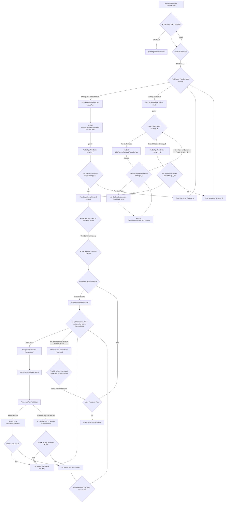
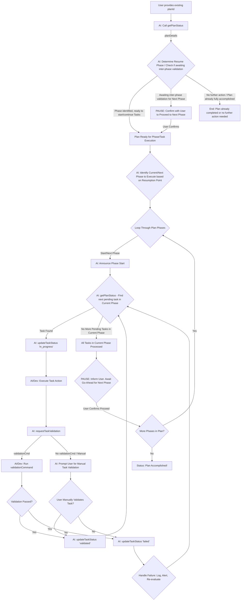

# AI Guide: Orchestrating Development with MCP Tools

This guide outlines how an AI agent can manage and drive development workflows using the VibePlannerTool's Model Context Protocol (MCP) interface. It covers starting new plans (PRDs), resuming existing ones, and the full lifecycle of task execution, incorporating mandatory pauses for human validation between phases.

## Core Concept: Human Validation Between Phases

A critical aspect of this workflow is a **mandatory pause for human review and approval** after all tasks within a given phase are completed and validated. The AI must inform the user of phase completion and explicitly wait for user confirmation (a go-ahead) before initiating any tasks in the subsequent phase. This ensures human oversight at key milestones.

## Use Case 1: Starting a New PRD from Scratch

This use case covers the scenario where a new feature, component, or project requires the creation of a new Product Requirements Document (PRD) and its corresponding development plan in the VibePlannerTool.

### 1.1. PRD Initiation & Approval (AI-Assisted)

1.  **User Request**: The process begins when a user requests the creation of a new plan/PRD.
2.  **PRD Generation (.md file)**:
    - The AI, guided by the standards in `.cursorrules/planning-documents`, assists in or generates the initial PRD content.
    - This Markdown (`.md`) file defines the plan's name, description, and critically, the detailed **phases and all tasks** within each phase.
3.  **User Review & Confirmation**:
    - The generated PRD (`.md` file) is presented to the user for review.
    - **Iterate**: If the user requests changes, the AI refines the PRD content. This cycle repeats until the user is satisfied.
    - **Proceed**: Once the user approves the PRD `.md` file.

### 1.2. Plan Creation in VibePlannerTool

Once the PRD `.md` is approved, the AI translates it into the `VibePlannerTool`. Two main strategies exist:

**Strategy A: Comprehensive `createPlan`**

- **Preparation**: The AI structures all information from the PRD (plan name, description, all phases with their details, and all tasks within those phases) into a format `VibePlannerTool/createPlan` can ingest.
  - _Assumption_: `createPlan` can process a comprehensive data structure for the entire plan hierarchy.
- **Execution**: Call `VibePlannerTool/createPlan` with the comprehensive structured data.
  - **Returns**: `{ planId, firstTask? }`.
- **Verification**: Call `VibePlannerTool/getPlanStatus` with the `planId`. Compare the reported structure against the PRD. If mismatched, alert the user and consider Strategy B or PRD format adjustments.

**Strategy B: Iterative Creation (if Strategy A fails or is not supported)**

- **Initial Plan Shell**: Call `VibePlannerTool/createPlan` with basic plan details (name, description).
  - **Returns**: `{ planId }`.
- **Iterate Through PRD Phases**: For each phase in the PRD:
  - Call `VibePlannerTool/addPhaseToPlan` (using `planId` and phase details from PRD).
  - **Returns**: `{ phaseId, ... }`.
  - **Iterate Through PRD Tasks (for current phase)**: For each task in the current PRD phase:
    - **Codebase Exploration & Task Detailing**: Before creating the task in the VibePlannerTool, the AI should thoroughly explore the relevant codebase. This exploration informs the creation of a very detailed task description, including specific files to be modified, functions to be implemented, or areas of code to be refactored. This detailed description is then used when calling `addTaskToPhase`.
    - Call `VibePlannerTool/addTaskToPhase` (using `phaseId` and the detailed task information from PRD and codebase exploration).
- **Overall Verification**: After all iterative additions, call `VibePlannerTool/getPlanStatus`. Compare against PRD. If mismatched, alert user and debug iterative steps.

If Strategy A is successful and verified, the plan is ready. If Strategy B is used and verified, the plan is ready.

**Post-Plan Creation User Confirmation**: Regardless of the strategy used, once the plan is successfully created and verified in `VibePlannerTool` (i.e., after `PLAN_SETUP_COMPLETE` in the diagram), the AI must:

1. Inform the user: "The plan '[Plan Name]' has been successfully created and verified in the VibePlannerTool."
2. Ask for confirmation: "Would you like to proceed with starting the first phase of this plan?"
3. **PAUSE**: The AI takes no further action on starting the plan execution until explicit user confirmation to proceed. If the user confirms, then the workflow proceeds to Section 1.3 (Phase-by-Phase Execution). If the user does not confirm, the plan remains in a ready state, awaiting further instruction.

### 1.3. Workflow Diagram for Starting a New PRD

### 1.3. Phase-by-Phase Execution (Full Cycle)

Once the plan is successfully created and verified in VibePlannerTool:

1.  **Identify Current/Next Phase**: The AI determines the first phase of the plan (e.g., based on `sequenceOrder` from `getPlanStatus` or the PRD).
2.  **Phase Loop**: For each phase in the plan:
    - **Announce Phase Start**: Inform the user, "Starting Phase: [Phase Name]".
    - **Task Loop (within current phase)**:
      - The AI consults `VibePlannerTool/getPlanStatus` to identify pending tasks for the _current active phase_.
      - If a pending task is found in the current phase:
        - Let this be `currentTask`.
        - Call `VibePlannerTool/updateTaskStatus` for `currentTask.id` to `in_progress`.
        - AI/Developer executes `currentTask`.
        - Call `VibePlannerTool/requestTaskValidation` for `currentTask.id`.
        - **Perform Validation**:
          - If `validationCommand` exists:
            - AI/Developer performs the validation steps or runs the command.
            - Call `VibePlannerTool/updateTaskStatus` for `currentTask.id` with results (`validated` or `failed`, and details).
          - If no `validationCommand` is present, or if automated validation is not feasible:
            - AI must **PAUSE** and inform the user: "Task '[currentTask.name]' requires manual validation. Please verify its completion and correctness."
            - Await user confirmation that the task is validated. The user might update the task status directly or instruct the AI.
            - Once confirmed, the AI calls `VibePlannerTool/updateTaskStatus` for `currentTask.id` to `validated`.
        - **Post-Validation Action**:
          - If `currentTask` is marked `validated` (either automatically or manually):
            - Loop back to identify the next pending task in _this phase_.
          - If `currentTask` is marked `failed`:
            - Log details, alert the user. The AI and user decide on re-attempting, marking as blocked, or other corrective actions.
            - After handling failure, loop back to identify the next pending task in _this phase_ (or await further instruction if the failure blocks progress).
      - If no more pending tasks are found for the _current active phase_ (i.e., all tasks in this phase are `validated`, `completed`, `failed`, `blocked`, or `cancelled`):
        - Proceed to "Human Phase Validation".
    - **Human Phase Validation**:
      - AI announces: "Phase '[Phase Name]' is complete. All tasks processed. Awaiting human validation and approval to proceed to the next phase."
      - **PAUSE**: The AI takes no further action on this plan until explicit user confirmation.
      - User reviews the completed phase and provides a go-ahead.
    - **Post-Validation**:
      - If user approves and more phases exist (determined from `getPlanStatus` or PRD): Identify and move to the next phase. Repeat Step 2 (Phase Loop).
      - If user approves and no more phases exist: The entire plan is accomplished. Announce: "Plan '[Plan Name]' fully accomplished!". End of workflow for this plan.
      - If user does not approve: The plan remains paused at this state. The AI may await further instructions or clarification.

## Use Case 2: Resuming an Existing PRD

This applies when a PRD/plan (`planId`) already exists in `VibePlannerTool`.

### 2.1. Plan State Retrieval

1.  **Obtain `planId`**: The AI is provided with the `planId` of the plan to resume.
2.  **Fetch Current State**: Call `VibePlannerTool/getPlanStatus` using the `planId`. This returns the plan's details, including all phases and the status of all their tasks.

### 2.2. Determine Resumption Point

1.  **Analyze Plan Status**: The AI examines the data from `getPlanStatus`.
2.  **Identify Active/Next Phase**:
    - Look for a phase with tasks that are `in_progress`. This is the active phase.
    - If no tasks are `in_progress`, look for the first phase (by `sequenceOrder`) that contains `pending` or `ready` tasks. This is the next phase to start.
    - If the most recently active phase has all its tasks completed (e.g., `validated`, `completed`), and this phase has not yet received human go-ahead for the _next_ phase:
      - AI announces: "Resuming plan '[Plan Name]'. Phase '[Last Completed Phase Name]' was finished. Awaiting human validation and approval to proceed to the next phase."
      - **PAUSE**: Await user confirmation.
      - If user confirms, identify the actual next phase by `sequenceOrder`. If no next phase, the plan is accomplished.
3.  Once the correct active phase to work on is identified (and human approval obtained if resuming after a completed phase), proceed to execution.

### 2.3. Phase-by-Phase Execution (Full Cycle)

Follow the same steps outlined in **Section 1.3: Phase-by-Phase Execution**, starting from the identified resumption phase.

### 2.4. Workflow Diagram for Resuming an Existing PRD

## Key MCP Tools Involved

The AI agent will primarily use the following MCP tools, namespaced under `mcp_vibe-planner`:

### General Tools:

- **`getPlanningScaffold`**:
  - **Description**: Retrieves the standard planning document template/scaffold (typically `planning-documents.md`).
  - **When to use**: At the very beginning of PRD generation (Use Case 1.1) to ensure the AI has the correct template to guide PRD creation.

### Plan Management Tools:

- **`createPlan`**:
  - **Description**: Creates a new development plan (PRD) shell in the system. It initializes the plan with a name, description, and optional status.
  - **When to use**:
    - In Use Case 1.2 (Strategy A, if `createPlan` is enhanced to take full structure, or Strategy B for initial shell). Primarily for creating the initial PRD record.
    - The current implementation creates a basic plan and logs if a first task could be fetched, but doesn't ingest full phase/task structures directly.
- **`createPhase`**:
  - **Description**: Adds a new phase to an existing development plan. Requires `planId`, phase name, and optional description and order.
  - **When to use**: In Use Case 1.2 (Strategy B), iteratively, after `createPlan` has been called, to define the stages of the plan.
- **`getPlanStatus`**:
  - **Description**: Retrieves the current status and detailed overview of a specific plan, including all its phases and their associated tasks.
  - **When to use**:
    - Crucial for verifying the plan structure after creation using `createPlan` and `createPhase` (Use Case 1.2).
    - Used to fetch the current state of an existing plan when resuming (Use Case 2.1).
    - Used by the AI to identify pending tasks within the current active phase and to determine if all tasks in a phase are complete (Use Case 1.3 and 2.3).
    - Helps in identifying the next phase after human validation.
- **`getAllAvailablePlans`**:
  - **Description**: Retrieves a list of all available development plans, potentially with summary details for each.
  - **When to use**: When the AI needs to present a list of existing plans to the user for selection, or for administrative overview purposes.
- **`updatePlanDetails`**:
  - **Description**: Modifies the core details of an existing plan, such as its name, description, or other mutable properties.
  - **When to use**: When a user requests to change the metadata of a plan, outside of its status or phase/task structure.
- **`updatePlanStatus`**:
  - **Description**: Updates the overall status of a development plan (e.g., from 'pending' to 'in_progress', 'on_hold', or 'completed').
  - **When to use**: To reflect changes in the lifecycle of the entire plan, such as starting work, pausing, or marking it as finished.
- **`deletePlan`**:
  - **Description**: Permanently removes a development plan from the system.
  - **When to use**: When a plan is no longer needed, is obsolete, or was created in error. This action should typically require user confirmation due to its destructive nature.

### Task Management Tools:

- **`createTask`**:
  - **Description**: Adds a new task to a specific phase within a plan. Requires `phaseId`, task name, and optional description, order, dependencies, and `validationCommand`.
    - The `description` should be highly detailed, informed by codebase exploration, outlining specific changes, files, and functions.
    - The `validationCommand` field should specify _what to do to validate_ the task. This can be a narrative description of manual validation steps, suggested test cases (e.g., "Write unit tests for X, Y, Z scenarios and ensure they pass"), or an actual command to run (e.g., `npm run test:specific-module`).
  - **When to use**: In Use Case 1.2 (Strategy B), iteratively, after `createPhase` has been called, to define the actionable items within each phase. The AI must perform codebase exploration to enrich the task details before this call.
- **`getNextTask`**:
  - **Description**: Gets the next available (pending and dependencies met) task for a given development plan. Returns the task object or null if no task is ready.
  - **When to use**:
    - Can be used to fetch the very first task after a plan is created or when resuming a plan.
    - Within the task loop (Use Case 1.3), this can help identify what to work on next, though the guide's current logic leans more on `getPlanStatus` for a comprehensive view of the current phase's tasks. This tool is useful if the AI needs to fetch one specific task that is ready to be worked on.
- **`updateTaskStatus`**:
  - **Description**: Updates a task's current state (e.g., `pending`, `in_progress`, `validated`, `failed`, `blocked`, `cancelled`) and can include details like validation output or notes.
  - **When to use**: Throughout the task lifecycle (Use Case 1.3 and 2.3) – before starting a task (`in_progress`), after validation (`validated`/`failed`), or if a task is blocked.
- **`requestTaskValidation`**:
  - **Description**: Retrieves the `validationCommand` for a specific task, if one is defined.
  - **When to use**: After a task's execution is complete (Use Case 1.3 and 2.3), to get the instructions or command needed to verify the task's outcome. The AI/Developer then interprets and acts on these instructions. If no command is defined, it will indicate that.

Refer to `docs/ai-consumer-guide.md` for detailed schemas of these methods.

## Interaction with `planning-documents` Rule

The `.cursorrules/planning-documents` rule remains critical during the **PRD Initiation** phase (Use Case 1). It dictates the structure, content, and quality of the PRD (`.md` file). This PRD is the blueprint for plan creation in `VibePlannerTool`, regardless of whether Strategy A or B is used for instantiation. The AI must ensure the `.md` PRD's details are accurately reflected in the `VibePlannerTool`.

By following these use cases and incorporating human validation between phases, the AI agent can manage the development lifecycle more collaboratively and robustly.
