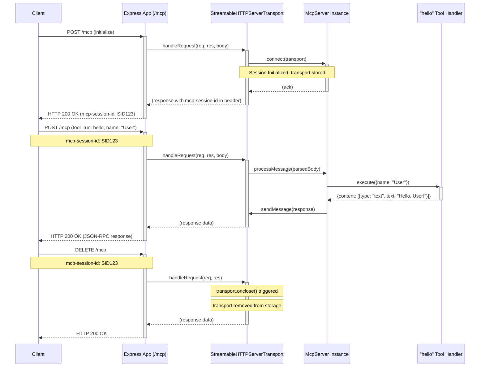

# MCP Server Bootstrap Plan

## 1. Overview

- **Context & Goals**:
  - This document outlines the plan to create a basic "Hello World" Model Context Protocol (MCP) server.
  - The primary goal is to establish a minimal, runnable MCP server instance using the official TypeScript SDK.
  - This server will serve as a foundational example for future MCP development and experimentation.
  - Successfully implementing this plan will verify the development environment and understanding of core MCP concepts.
- **Current Pain Points**:
  - No existing MCP server or practical example within the current project.
  - Lack of a hands-on starting point for learning MCP server development.
  - Uncertainty about the initial setup and required dependencies for an MCP server.

## 2. Proposed Solution

- **High-level Summary**:
  - Initialize a new Node.js project with TypeScript.
  - Install the `@modelcontextprotocol/sdk` and necessary dependencies (e.g., `express`, `zod`).
  - Implement a simple MCP server that exposes a single "hello" tool.
  - The "hello" tool will accept an optional `name` parameter and return a greeting string.
  - The server will use the Streamable HTTP transport with Express.js.
- **Architecture & Directory Structure**:
  ```
  /cursor-tasklist-mcp/
  ├── docs/
  │   └── bootstrap-plan.md
  ├── src/
  │   └── server.ts
  ├── package.json
  ├── tsconfig.json
  └── .gitignore
  ```

## 3. Implementation Plan

- **Phase 1: Project Setup (0.5 day)**

  1.  Initialize a new Node.js project: `npm init -y`.
  2.  Install TypeScript as a dev dependency: `npm install -D typescript @types/node @types/express`.
  3.  Initialize `tsconfig.json`: `npx tsc --init`.
      - Configure `outDir` to `./dist` and `rootDir` to `./src`.
      - Ensure `esModuleInterop` and `resolveJsonModule` are true.
      - Set `module` to `NodeNext` and `moduleResolution` to `NodeNext`.
  4.  Install MCP SDK and dependencies: `npm install @modelcontextprotocol/sdk express zod`.
  5.  Create a `.gitignore` file (e.g., from gitignore.io for Node).
  6.  Add scripts to `package.json` for `build` (`tsc`) and `start` (`node dist/server.js`).

- **Phase 2: Basic MCP Server Implementation (1 day)**
  1.  Create `src/server.ts`.
  2.  Import necessary modules from `@modelcontextprotocol/sdk`, `express`, and `zod`.
  3.  Initialize an Express app.
  4.  Create an `McpServer` instance with a name and version.
  5.  Define a "hello" tool:
      - Input schema: `{ name: z.string().optional() }`.
      - Handler: Returns `Hello, ${name || 'World'}!`.
  6.  Set up `StreamableHTTPServerTransport` with session management (as shown in SDK examples).
  7.  Connect the `McpServer` to the transport.
  8.  Mount the transport handler on an Express route (e.g., `/mcp`).
  9.  Start the Express server on a specified port (e.g., 3000).

## 4. File and Directory Structures

- **`package.json`**: Standard Node.js project manifest, including dependencies and scripts.
  ```json
  {
    "name": "mcp-hello-world-server",
    "version": "1.0.0",
    "description": "A basic Hello World MCP server.",
    "main": "dist/server.js",
    "scripts": {
      "build": "tsc",
      "start": "node dist/server.js",
      "dev": "npm run build && npm run start"
    },
    "keywords": ["mcp", "server", "typescript"],
    "author": "",
    "license": "ISC",
    "dependencies": {
      "@modelcontextprotocol/sdk": "^1.11.4", // Use latest version
      "express": "^4.17.1",
      "zod": "^3.20.2"
    },
    "devDependencies": {
      "@types/express": "^4.17.13",
      "@types/node": "^16.11.7",
      "typescript": "^4.5.2"
    }
  }
  ```
- **`tsconfig.json`**: TypeScript compiler configuration.
  ```json
  {
    "compilerOptions": {
      "target": "es2020",
      "module": "NodeNext",
      "moduleResolution": "NodeNext",
      "outDir": "./dist",
      "rootDir": "./src",
      "strict": true,
      "esModuleInterop": true,
      "skipLibCheck": true,
      "forceConsistentCasingInFileNames": true,
      "resolveJsonModule": true
    },
    "include": ["src/**/*"],
    "exclude": ["node_modules", "**/*.spec.ts"]
  }
  ```
- **`src/server.ts`**: Main server implementation file. (Skeleton in Technical Details)

## 5. Technical Details

- **`src/server.ts`**

  ```typescript
  import express from 'express';
  import { randomUUID } from 'node:crypto';
  import {
    McpServer,
    StreamableHTTPServerTransport,
    isInitializeRequest,
  } from '@modelcontextprotocol/sdk';
  import { z } from 'zod';

  const app = express();
  app.use(express.json());

  const mcpServer = new McpServer({
    name: 'HelloWorldServer',
    version: '1.0.0',
  });

  // Define the 'hello' tool
  mcpServer.tool('hello', { name: z.string().optional() }, async ({ name }) => {
    const greeting = `Hello, ${name || 'World'}!`;
    return {
      content: [{ type: 'text', text: greeting }],
    };
  });

  const transports: { [sessionId: string]: StreamableHTTPServerTransport } = {};

  app.post('/mcp', async (req, res) => {
    const sessionId = req.headers['mcp-session-id'] as string | undefined;
    let transport: StreamableHTTPServerTransport;

    if (sessionId && transports[sessionId]) {
      transport = transports[sessionId];
    } else if (!sessionId && isInitializeRequest(req.body)) {
      transport = new StreamableHTTPServerTransport({
        sessionIdGenerator: () => randomUUID(),
        onsessioninitialized: (newSessionId) => {
          transports[newSessionId] = transport;
          console.log(`Session initialized: ${newSessionId}`);
        },
      });

      transport.onclose = () => {
        if (transport.sessionId) {
          console.log(`Session closed: ${transport.sessionId}`);
          delete transports[transport.sessionId];
        }
      };

      await mcpServer.connect(transport);
    } else {
      res.status(400).json({
        jsonrpc: '2.0',
        error: {
          code: -32000,
          message: 'Bad Request: No valid session ID provided',
        },
        id: null,
      });
      return;
    }
    await transport.handleRequest(req, res, req.body);
  });

  app.get('/mcp', async (req, res) => {
    const sessionId = req.headers['mcp-session-id'] as string | undefined;
    if (!sessionId || !transports[sessionId]) {
      res.status(400).send('Invalid or missing session ID');
      return;
    }
    const transport = transports[sessionId];
    await transport.handleRequest(req, res);
  });

  app.delete('/mcp', async (req, res) => {
    const sessionId = req.headers['mcp-session-id'] as string | undefined;
    if (!sessionId || !transports[sessionId]) {
      res.status(400).send('Invalid or missing session ID');
      return;
    }
    const transport = transports[sessionId];
    await transport.handleRequest(req, res);
    if (transport.sessionId) {
      console.log(`Session deleted: ${transport.sessionId}`);
      delete transports[transport.sessionId];
    }
  });

  const port = process.env.PORT || 3000;
  app.listen(port, () => {
    console.log(`MCP Hello World server listening on port ${port}`);
    console.log(`MCP endpoint available at http://localhost:${port}/mcp`);
  });
  ```

## 6. Usage Examples

- To interact with the server, an MCP client would be needed. A conceptual example using a generic MCP client tool (like one found in an IDE with MCP support):

  1.  **Initialize session (client-side, conceptual)**:

      ```
      POST /mcp
      Content-Type: application/json

      {
        "jsonrpc": "2.0",
        "method": "initialize",
        "params": {
          "clientName": "TestClient",
          "clientVersion": "1.0.0",
          "protocolVersion": "2025-03-26" // Or current version
        },
        "id": "init-1"
      }
      ```

      (Server responds with session ID in header `mcp-session-id`)

  2.  **Call the "hello" tool (client-side, conceptual)**:

      ```
      POST /mcp
      Content-Type: application/json
      mcp-session-id: <session-id-from-init>

      {
        "jsonrpc": "2.0",
        "method": "tool_run",
        "params": {
          "toolName": "hello",
          "inputs": { "name": "User" }
        },
        "id": "tool-run-1"
      }
      ```

      Expected response content: `Hello, User!`

  3.  **Call the "hello" tool without name (client-side, conceptual)**:

      ```
      POST /mcp
      Content-Type: application/json
      mcp-session-id: <session-id-from-init>

      {
        "jsonrpc": "2.0",
        "method": "tool_run",
        "params": {
          "toolName": "hello",
          "inputs": {}
        },
        "id": "tool-run-2"
      }
      ```

      Expected response content: `Hello, World!`

  4.  **Terminate session (client-side, conceptual)**:
      ```
      DELETE /mcp
      mcp-session-id: <session-id-from-init>
      ```

## 7. Testing Strategy

- **Unit Tests**:
  - Test the "hello" tool handler directly:
    - Given a name, returns the correct greeting.
    - Given no name, returns "Hello, World!".
- **Integration Tests** (Manual for now, using `curl` or a tool like Postman/Insomnia):
  - Send an `initialize` request to `/mcp` and verify a session ID is returned.
  - Send a `tool_run` request for the "hello" tool with a name and verify the response.
  - Send a `tool_run` request for the "hello" tool without a name and verify the response.
  - Send a `terminate` request to `/mcp` and verify the session is closed.

## 8. Edge Cases

| Edge Case                                    | Remediation                                                                 |
| :------------------------------------------- | :-------------------------------------------------------------------------- |
| Invalid JSON in request body                 | Express `json` middleware should handle this, returning a 400 error.        |
| Missing `mcp-session-id` header (after init) | Server responds with 400 error as per current implementation.               |
| Invalid `mcp-session-id`                     | Server responds with 400 error.                                             |
| Tool name not found                          | MCP server SDK should handle this, returning an appropriate JSON-RPC error. |
| Invalid input for the "hello" tool           | Zod schema validation should catch this; MCP server SDK handles errors.     |

## 9. Sequence Diagram



## 10. Risks & Mitigations

| Risk                                                     | Mitigation                                                                                                  |
| :------------------------------------------------------- | :---------------------------------------------------------------------------------------------------------- |
| SDK version incompatibilities or bugs.                   | Use the latest stable version of `@modelcontextprotocol/sdk`. Refer to official examples and documentation. |
| Complexity in understanding MCP session management.      | Start with the simplest session management example from the SDK and incrementally build upon it.            |
| Difficulties debugging MCP communication.                | Use `console.log` extensively on both server and client (if possible). Check MCP Inspector tool if needed.  |
| TypeScript configuration issues.                         | Follow standard Node.js TypeScript setup. Consult official TypeScript and ts-node documentation.            |
| Changes in the MCP specification affecting SDK behavior. | Pin the SDK version. Regularly check the MCP GitHub repository for updates and breaking changes.            |

## 11. Timeline

- **Phase 1: Project Setup**: 0.5 day
- **Phase 2: Basic MCP Server Implementation**: 1 day
- **Total Estimated Time**: 1.5 days

## 12. Acceptance Criteria

- A new Node.js project is created with TypeScript and necessary dependencies.
- The `package.json` includes scripts for building and starting the server.
- The `tsconfig.json` is correctly configured.
- An `src/server.ts` file exists containing the MCP server logic.
- The server starts without errors when running `npm start`.
- The server exposes an MCP endpoint at `/mcp`.
- The server has a "hello" tool registered.
- The "hello" tool correctly responds with "Hello, World!" when no name is provided.
- The "hello" tool correctly responds with "Hello, [Name]!" when a name is provided.
- Manual tests using `curl` or a similar tool confirm basic MCP communication (initialize, tool_run, terminate).
- The server logs session initialization and closure.

## 13. Conclusion

This plan details the steps to bootstrap a minimal "Hello World" MCP server using the TypeScript SDK. Completing this plan will provide a working foundation and a practical learning experience for MCP development. The resulting server will be a simple but complete example of an MCP tool provider.

## 14. Assumptions & Dependencies

- Node.js and npm are installed on the development machine.
- Familiarity with TypeScript and Node.js/Express development.
- Access to the internet for installing dependencies and referring to documentation.
- The `@modelcontextprotocol/sdk` is stable and its documentation/examples are up-to-date.
- A tool capable of making HTTP requests (like `curl`, Postman, or an MCP-enabled IDE) will be used for manual testing.
- The target MCP protocol version is the one supported by the latest SDK.
- The `planning-documents` rule and web search results provide sufficient context for this plan.
