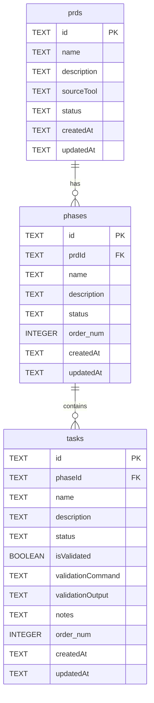

# VibePlanner Database Schema

This document outlines the database schema for the VibePlanner application, including an Entity Relationship Diagram (ERD) and the Data Definition Language (SQL) statements.

## Entity Relationship Diagram (ERD)



_Note: `order_num` is used in the diagram for clarity as `order` can be a reserved keyword in some SQL contexts, though in the DDL it is `order`._

## SQL Schema (DDL)

The following SQL statements define the tables and triggers for the VibePlanner database, intended for use with SQLite.

```sql
CREATE TABLE IF NOT EXISTS prds (
  id TEXT PRIMARY KEY,
  name TEXT NOT NULL,
  description TEXT,
  sourceTool TEXT,
  status TEXT DEFAULT 'pending',
  createdAt TEXT DEFAULT CURRENT_TIMESTAMP,
  updatedAt TEXT DEFAULT CURRENT_TIMESTAMP
);

CREATE TABLE IF NOT EXISTS phases (
  id TEXT PRIMARY KEY,
  prdId TEXT NOT NULL,
  name TEXT NOT NULL,
  description TEXT,
  status TEXT DEFAULT 'pending',
  "order" INTEGER,
  createdAt TEXT DEFAULT CURRENT_TIMESTAMP,
  updatedAt TEXT DEFAULT CURRENT_TIMESTAMP,
  FOREIGN KEY (prdId) REFERENCES prds(id) ON DELETE CASCADE
);

CREATE TABLE IF NOT EXISTS tasks (
  id TEXT PRIMARY KEY,
  phaseId TEXT NOT NULL,
  name TEXT NOT NULL,
  description TEXT,
  status TEXT DEFAULT 'pending',
  isValidated BOOLEAN DEFAULT FALSE,
  validationCommand TEXT,
  validationOutput TEXT,
  notes TEXT,
  "order" INTEGER,
  createdAt TEXT DEFAULT CURRENT_TIMESTAMP,
  updatedAt TEXT DEFAULT CURRENT_TIMESTAMP,
  FOREIGN KEY (phaseId) REFERENCES phases(id) ON DELETE CASCADE
);

CREATE TRIGGER IF NOT EXISTS update_prds_updatedAt
AFTER UPDATE ON prds
FOR EACH ROW
BEGIN
    UPDATE prds SET updatedAt = CURRENT_TIMESTAMP WHERE id = OLD.id;
END;

CREATE TRIGGER IF NOT EXISTS update_phases_updatedAt
AFTER UPDATE ON phases
FOR EACH ROW
BEGIN
    UPDATE phases SET updatedAt = CURRENT_TIMESTAMP WHERE id = OLD.id;
END;

CREATE TRIGGER IF NOT EXISTS update_tasks_updatedAt
AFTER UPDATE ON tasks
FOR EACH ROW
BEGIN
    UPDATE tasks SET updatedAt = CURRENT_TIMESTAMP WHERE id = OLD.id;
END;
```
