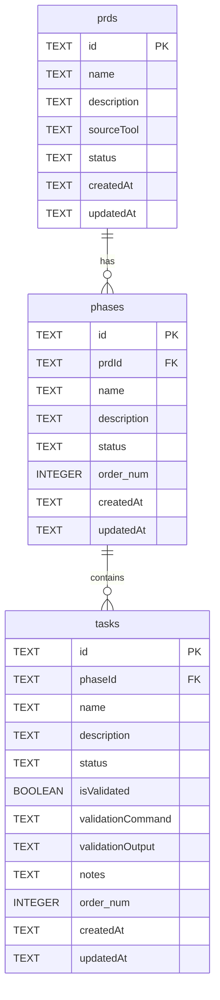

# VibePlanner Database Schema

This document outlines the database schema for the VibePlanner application, including an Entity Relationship Diagram (ERD) and the Data Definition Language (SQL) statements.

## Entity Relationship Diagram (ERD)



_Note: `order_num` is used in the diagram for clarity as `order` can be a reserved keyword in some SQL contexts, though in the DDL it is `order`._

## SQL Schema (DDL)

The following SQL statements define the tables and triggers for the VibePlanner database, intended for use with SQLite.

```sql
-- Prds Table
CREATE TABLE IF NOT EXISTS prds (
    id TEXT PRIMARY KEY,
    name TEXT NOT NULL,
    description TEXT,
    status TEXT NOT NULL DEFAULT 'pending',
    creationDate TEXT NOT NULL,
    updatedAt TEXT NOT NULL,
    completionDate TEXT
);

-- Phases Table
CREATE TABLE IF NOT EXISTS phases (
    id TEXT PRIMARY KEY,
    name TEXT NOT NULL,
    description TEXT,
    status TEXT NOT NULL DEFAULT 'pending',
    creationDate TEXT NOT NULL,
    updatedAt TEXT NOT NULL,
    completionDate TEXT,
    "order" INTEGER NOT NULL, -- "order" is a keyword, so quoted
    prdId TEXT NOT NULL,
    FOREIGN KEY (prdId) REFERENCES prds(id) ON DELETE CASCADE
);

-- Tasks Table
CREATE TABLE IF NOT EXISTS tasks (
    id TEXT PRIMARY KEY,
    name TEXT NOT NULL,
    description TEXT,
    status TEXT NOT NULL DEFAULT 'pending',
    isValidated BOOLEAN NOT NULL DEFAULT 0,
    creationDate TEXT NOT NULL,
    updatedAt TEXT NOT NULL,
    completionDate TEXT,
    "order" INTEGER NOT NULL, -- "order" is a keyword, so quoted
    phaseId TEXT NOT NULL,
    validationCommand TEXT,
    validationOutput TEXT,
    notes TEXT,
    FOREIGN KEY (phaseId) REFERENCES phases(id) ON DELETE CASCADE
);

-- Task Dependencies Table (Many-to-Many)
-- A task can have multiple dependencies, and can be a dependency for multiple tasks.
CREATE TABLE IF NOT EXISTS task_dependencies (
    taskId TEXT NOT NULL,
    dependencyId TEXT NOT NULL,
    PRIMARY KEY (taskId, dependencyId),
    FOREIGN KEY (taskId) REFERENCES tasks(id) ON DELETE CASCADE,
    FOREIGN KEY (dependencyId) REFERENCES tasks(id) ON DELETE CASCADE
);

CREATE TRIGGER IF NOT EXISTS update_prds_updatedAt
AFTER UPDATE ON prds
FOR EACH ROW
BEGIN
    UPDATE prds SET updatedAt = CURRENT_TIMESTAMP WHERE id = OLD.id;
END;

CREATE TRIGGER IF NOT EXISTS update_phases_updatedAt
AFTER UPDATE ON phases
FOR EACH ROW
BEGIN
    UPDATE phases SET updatedAt = CURRENT_TIMESTAMP WHERE id = OLD.id;
END;

CREATE TRIGGER IF NOT EXISTS update_tasks_updatedAt
AFTER UPDATE ON tasks
FOR EACH ROW
BEGIN
    UPDATE tasks SET updatedAt = CURRENT_TIMESTAMP WHERE id = OLD.id;
END;
```
