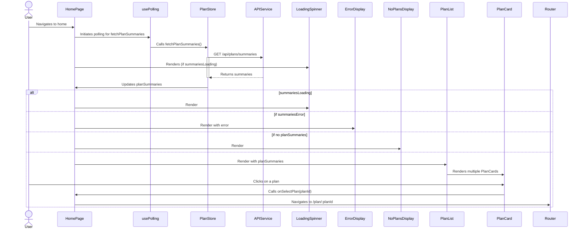

# Refactoring Plan: HomePage Component

## 1. Overview

- **Context & Goals**:
  - The current `HomePage.tsx` component is responsible for fetching, displaying, and handling interactions for plan summaries.
  - The goal is to improve maintainability, readability, and testability by breaking it down into smaller, focused components.
  - This refactoring will promote reusability of UI elements and make the codebase easier to understand and scale.
- **Current Pain Points**:
  - Large component with multiple responsibilities (data fetching, loading/error states, rendering plan list, rendering individual plan cards).
  - Difficult to test individual pieces of UI or logic in isolation.
  - Harder to onboard new developers to this part of the codebase.

## 2. Proposed Solution

- **High-level Summary**:
  - Extract loading and error states into separate, reusable components.
  - Create a component for the "No Plans Available" state.
  - Create a `PlanList` component to manage the grid layout and mapping of plan summaries.
  - Create a `PlanCard` component to display individual plan summary details and handle selection.
  - The `HomePage` component will retain responsibility for data fetching logic (via `usePolling` and `usePlanStore`) and orchestrating the display of the appropriate state (loading, error, no plans, or plan list).
- **Architecture & Directory Structure**:
  ```
  client/src/
  ├── components/
  │   ├── common/                 # New directory for shared, generic components
  │   │   ├── LoadingSpinner.tsx
  │   │   └── ErrorDisplay.tsx
  │   ├── home/                   # New directory for HomePage specific components
  │   │   ├── NoPlansDisplay.tsx
  │   │   ├── PlanList.tsx
  │   │   └── PlanCard.tsx
  │   └── ... (other components)
  ├── hooks/
  │   └── usePolling.ts
  ├── pages/
  │   └── HomePage.tsx            # Will be refactored
  ├── store/
  │   └── planStore.ts
  └── types/
      └── index.ts                # Assuming PrdSummary is here or in a dedicated types file
  ```

## 3. Implementation Plan

- **Phase 1: Create Common State Components (0.5 day)**
  1.  Create `client/src/components/common/LoadingSpinner.tsx`.
  2.  Implement the loading spinner UI as seen in `HomePage.tsx`.
  3.  Create `client/src/components/common/ErrorDisplay.tsx`.
  4.  Implement the error display UI, accepting an error message prop.
  5.  Unit test `LoadingSpinner.tsx` and `ErrorDisplay.tsx`.
- **Phase 2: Create "No Plans" Component (0.5 day)**
  1.  Create `client/src/components/home/NoPlansDisplay.tsx`.
  2.  Implement the UI for when no plans are available, including the "Create Your First Plan" button.
  3.  Potentially accept a prop for the "Create Plan" button's `onClick` handler if it's intended to be dynamic.
  4.  Unit test `NoPlansDisplay.tsx`.
- **Phase 3: Create PlanCard Component (1 day)**
  1.  Create `client/src/components/home/PlanCard.tsx`.
  2.  Define props: `summary: PrdSummary`, `onSelectPlan: (planId: string) => void`.
  3.  Migrate the JSX and logic for rendering a single plan card from `HomePage.tsx` into `PlanCard.tsx`.
  4.  Ensure all necessary imports (icons, types) are included.
  5.  Style the component as per the original design.
  6.  Unit test `PlanCard.tsx` (e.g., renders name, description, progress, handles click).
- **Phase 4: Create PlanList Component (0.5 day)**
  1.  Create `client/src/components/home/PlanList.tsx`.
  2.  Define props: `planSummaries: PrdSummary[]`, `onSelectPlan: (planId: string) => void`.
  3.  Migrate the grid layout and the `.map` function that renders `PlanCard` components.
  4.  `PlanList` will iterate over `planSummaries` and render a `PlanCard` for each.
  5.  Unit test `PlanList.tsx` (e.g., renders correct number of cards, passes props correctly).
- **Phase 5: Refactor HomePage Component (1 day)**
  1.  Modify `client/src/pages/HomePage.tsx`.
  2.  Import the newly created components: `LoadingSpinner`, `ErrorDisplay`, `NoPlansDisplay`, `PlanList`.
  3.  Replace the inline JSX for loading, error, and no-plans states with the respective components.
  4.  Replace the plan summaries mapping logic with the `PlanList` component, passing `planSummaries` and `handleSelectPlan` as props.
  5.  Remove unused imports and code from `HomePage.tsx`.
  6.  Perform integration testing to ensure `HomePage` works as expected with the new components.

## 4. File and Directory Structures

```
client/
├── src/
│   ├── components/
│   │   ├── common/
│   │   │   ├── LoadingSpinner.tsx
│   │   │   └── ErrorDisplay.tsx
│   │   ├── home/
│   │   │   ├── NoPlansDisplay.tsx
│   │   │   ├── PlanCard.tsx
│   │   │   └── PlanList.tsx
│   │   ├── kanban/
│   │   ├── layout/
│   │   └── plans/
│   ├── hooks/
│   │   └── usePolling.ts
│   ├── lib/
│   ├── pages/
│   │   └── HomePage.tsx
│   ├── store/
│   │   └── planStore.ts
│   ├── types/
│   │   └── index.ts
│   ├── App.tsx
│   ├── main.tsx
│   └── vite-env.d.ts
├── vite.config.ts
├── tsconfig.json
└── package.json
```

## 5. Technical Details

- **`LoadingSpinner.tsx`**:

  ```tsx
  import React from 'react';

  const LoadingSpinner: React.FC = () => {
    return (
      <div className='flex flex-col items-center justify-center text-center flex-1 p-6'>
        <span className='loading loading-lg loading-spinner text-primary mb-4'></span>
      </div>
    );
  };

  export default LoadingSpinner;
  ```

- **`ErrorDisplay.tsx`**:

  ```tsx
  import React from 'react';
  import { Zap } from 'lucide-react';

  interface ErrorDisplayProps {
    message: string;
  }

  const ErrorDisplay: React.FC<ErrorDisplayProps> = ({ message }) => {
    return (
      <div className='flex flex-col items-center justify-center text-center flex-1 p-6'>
        <Zap size={48} className='text-error mb-4 opacity-70' />
        <p className='text-xl text-error-content mb-1'>Could not load plans.</p>
        <p className='text-sm text-error-content opacity-80'>
          Error: {message}
        </p>
      </div>
    );
  };

  export default ErrorDisplay;
  ```

- **`NoPlansDisplay.tsx`**:

  ```tsx
  import React from 'react';
  import { Briefcase } from 'lucide-react';

  interface NoPlansDisplayProps {
    onCreatePlan?: () => void; // Optional: if we want to handle creation from parent
  }

  const NoPlansDisplay: React.FC<NoPlansDisplayProps> = ({ onCreatePlan }) => {
    return (
      <div className='flex flex-col items-center justify-center text-center flex-1 p-6'>
        <Briefcase size={48} className='text-neutral-content mb-4 opacity-50' />
        <p className='text-xl text-neutral-content opacity-60 mb-4'>
          No plans available yet.
        </p>
        <button className='btn btn-primary btn-sm' onClick={onCreatePlan}>
          Create Your First Plan
        </button>
      </div>
    );
  };

  export default NoPlansDisplay;
  ```

- **`PlanCard.tsx`**:

  ```tsx
  import React from 'react';
  import { Calendar } from 'lucide-react';
  import { PrdSummary } from '../../types'; // Adjust path as needed

  interface PlanCardProps {
    summary: PrdSummary;
    onSelectPlan: (planId: string) => void;
  }

  const PlanCard: React.FC<PlanCardProps> = ({ summary, onSelectPlan }) => {
    const totalTasks = summary.totalTasks || 0;
    const completedTasks = summary.completedTasks || 0;
    const percentage = totalTasks > 0 ? (completedTasks / totalTasks) * 100 : 0;

    return (
      <div
        onClick={() => onSelectPlan(summary.id)}
        className='bg-base-200 p-4 rounded-lg shadow-md hover:shadow-xl transition-all duration-300 ease-in-out cursor-pointer flex flex-col justify-between group min-h-[200px] border border-transparent hover:border-primary/30'
        role='button'
        tabIndex={0}
        onKeyPress={(e) => e.key === 'Enter' && onSelectPlan(summary.id)}
      >
        {/* ... content from HomePage for a single card ... */}
        <div className='flex-grow'>
          <h3
            className='font-semibold text-lg text-base-content group-hover:text-primary transition-colors duration-300 mb-2 truncate'
            title={summary.name}
          >
            {summary.name}
          </h3>
          {summary.description && (
            <p
              className='text-sm text-base-content opacity-75 mb-3 line-clamp-3 leading-relaxed'
              title={summary.description}
            >
              {summary.description}
            </p>
          )}
        </div>

        <div className='my-3'>
          <div className='flex justify-between text-xs text-neutral-content opacity-80 mb-1'>
            <span>Progress</span>
            <span>{`${completedTasks}/${totalTasks} tasks`}</span>
          </div>
          <div className='w-full bg-base-300 rounded-full h-2.5'>
            <div
              className='bg-primary h-2.5 rounded-full transition-all duration-500 ease-out'
              style={{ width: `${percentage}%` }}
            ></div>
          </div>
          {/* ... progress messages ... */}
        </div>

        <div className='mt-auto pt-3 border-t border-base-300/70'>
          <div className='flex items-center text-xs text-neutral-content opacity-70'>
            <Calendar size={12} className='mr-1.5 flex-shrink-0' />
            <span>
              Created: {new Date(summary.createdAt).toLocaleDateString()}
            </span>
          </div>
        </div>
      </div>
    );
  };

  export default PlanCard;
  ```

- **`PlanList.tsx`**:

  ```tsx
  import React from 'react';
  import { PrdSummary } from '../../types'; // Adjust path as needed
  import PlanCard from './PlanCard';

  interface PlanListProps {
    planSummaries: PrdSummary[];
    onSelectPlan: (planId: string) => void;
  }

  const PlanList: React.FC<PlanListProps> = ({
    planSummaries,
    onSelectPlan,
  }) => {
    return (
      <div className='grid grid-cols-1 sm:grid-cols-2 lg:grid-cols-3 xl:grid-cols-4 gap-4 md:gap-5'>
        {planSummaries.map((summary) => (
          <PlanCard
            key={summary.id}
            summary={summary}
            onSelectPlan={onSelectPlan}
          />
        ))}
      </div>
    );
  };

  export default PlanList;
  ```

## 6. Usage Examples

- **Refactored `HomePage.tsx`**:

  ```tsx
  import React from 'react';
  import { useNavigate } from 'react-router-dom';
  import usePolling from '../hooks/usePolling';
  import { usePlanStore } from '../store/planStore';
  import LoadingSpinner from '../components/common/LoadingSpinner';
  import ErrorDisplay from '../components/common/ErrorDisplay';
  import NoPlansDisplay from '../components/home/NoPlansDisplay';
  import PlanList from '../components/home/PlanList';

  const HomePage: React.FC = () => {
    const navigate = useNavigate();
    const {
      planSummaries,
      summariesLoading,
      summariesError,
      fetchPlanSummaries,
    } = usePlanStore();

    usePolling(fetchPlanSummaries, 3000);

    const handleSelectPlan = (planId: string) => {
      navigate(`/plan/${planId}`);
    };

    if (summariesLoading) {
      return (
        <main className='flex-1 bg-base-100 p-6 rounded-lg shadow'>
          <LoadingSpinner />
        </main>
      );
    }

    if (summariesError) {
      return (
        <main className='flex-1 bg-base-100 p-6 rounded-lg shadow'>
          <ErrorDisplay message={summariesError.message} />
        </main>
      );
    }

    if (!Array.isArray(planSummaries) || planSummaries.length === 0) {
      return (
        <main className='flex-1 bg-base-100 p-6 rounded-lg shadow'>
          <NoPlansDisplay />
        </main>
      );
      // Potentially: <NoPlansDisplay onCreatePlan={() => navigate('/create-plan')} />
    }

    return (
      <main className='flex-1 bg-base-100 p-4 md:p-6 rounded-lg shadow'>
        <PlanList
          planSummaries={planSummaries}
          onSelectPlan={handleSelectPlan}
        />
      </main>
    );
  };

  export default HomePage;
  ```

## 7. Testing Strategy

- **Unit Tests**:
  - `LoadingSpinner.tsx`: Renders correctly.
  - `ErrorDisplay.tsx`: Renders error icon and message prop.
  - `NoPlansDisplay.tsx`: Renders correct text and button. Test `onCreatePlan` callback if implemented.
  - `PlanCard.tsx`:
    - Renders plan name, description (if present).
    - Calculates and displays progress correctly (tasks, percentage).
    - Displays correct progress messages (no tasks, in progress, complete).
    - Renders creation date.
    - Calls `onSelectPlan` with correct `planId` on click and Enter key press.
  - `PlanList.tsx`:
    - Renders the correct number of `PlanCard` components based on `planSummaries` prop.
    - Passes `summary` and `onSelectPlan` props correctly to each `PlanCard`.
    - Renders an empty state or nothing if `planSummaries` is empty (though `HomePage` handles the "no plans" state).
  - `HomePage.tsx` (after refactor):
    - Correctly displays `LoadingSpinner` when `summariesLoading` is true.
    - Correctly displays `ErrorDisplay` with message when `summariesError` is present.
    - Correctly displays `NoPlansDisplay` when `planSummaries` is empty or not an array.
    - Correctly displays `PlanList` with summaries when data is available.
    - `handleSelectPlan` navigates to the correct URL.
- **Integration Tests**:
  - Full `HomePage` flow:
    - Mock API responses for plan summaries (loading, error, empty, with data).
    - Verify the correct components are rendered in each state.
    - Verify navigation works when a plan card is clicked.

## 8. Edge Cases

| Edge Case                                   | Remediation                                                                                                   |
| ------------------------------------------- | ------------------------------------------------------------------------------------------------------------- |
| `PrdSummary` object missing optional fields | `PlanCard` should gracefully handle missing `description`, `totalTasks`, or `completedTasks` (defaults to 0). |
| API returns unexpected data structure       | `usePlanStore` should ideally perform data validation/transformation; `ErrorDisplay` will catch fetch errors. |
| Very long plan names or descriptions        | `PlanCard` uses `truncate` and `line-clamp` for text overflow, titles provide full text on hover.             |
| Zero total tasks                            | `PlanCard` correctly displays "No tasks yet" and 0% progress.                                                 |
| Network interruptions during polling        | `usePolling` and `usePlanStore` should handle this; `summariesError` state will be set.                       |

## 9. Sequence Diagram



## 10. Risks & Mitigations

| Risk                                               | Mitigation                                                                                                                                                                            |
| -------------------------------------------------- | ------------------------------------------------------------------------------------------------------------------------------------------------------------------------------------- |
| Introducing regressions during refactoring         | Thorough unit and integration testing for each new component and the refactored `HomePage`. Pair programming or code reviews.                                                         |
| Incorrect prop drilling or state management        | Clearly define component props. Rely on Zustand (`usePlanStore`) for global state, pass callbacks for actions.                                                                        |
| Styling inconsistencies in new components          | Reuse existing Tailwind CSS classes and verify visual output against the original design.                                                                                             |
| Performance issues with many plan cards (if any)   | `React.memo` for `PlanCard` if re-renders become an issue, though unlikely with current scope. Virtualization for `PlanList` if thousands of cards were expected (not the case here). |
| Increased build time/bundle size due to more files | Minimal impact for this scale. Tree shaking should handle unused code. Monitor bundle size if it becomes a concern.                                                                   |

## 11. Timeline

- **Total Estimated Time**: 3.5 days
- **Breakdown**:
  - Phase 1: Common State Components - 0.5 day
  - Phase 2: "No Plans" Component - 0.5 day
  - Phase 3: PlanCard Component - 1 day
  - Phase 4: PlanList Component - 0.5 day
  - Phase 5: Refactor HomePage Component - 1 day

## 12. Acceptance Criteria

- All JSX related to loading state in `HomePage.tsx` is replaced by the `LoadingSpinner` component.
- All JSX related to error state in `HomePage.tsx` is replaced by the `ErrorDisplay` component.
- All JSX related to the "no plans available" state in `HomePage.tsx` is replaced by the `NoPlansDisplay` component.
- The logic and JSX for rendering the list of plan summaries in `HomePage.tsx` is moved to the `PlanList` component.
- The logic and JSX for rendering an individual plan summary card in `HomePage.tsx` is moved to the `PlanCard` component.
- `HomePage.tsx` correctly orchestrates the display of `LoadingSpinner`, `ErrorDisplay`, `NoPlansDisplay`, or `PlanList` based on application state.
- All functionalities of the original `HomePage.tsx` (displaying plans, progress, handling selection) are preserved.
- New components (`LoadingSpinner`, `ErrorDisplay`, `NoPlansDisplay`, `PlanCard`, `PlanList`) are created in the specified directory structure.
- Unit tests are written for all new components, covering their basic rendering and functionality.
- The application compiles (`yarn tsc`), lints (`yarn lint`), and existing tests pass (`yarn test`) after the refactoring.

## 13. Conclusion

Refactoring `HomePage.tsx` into smaller, specialized components will significantly improve the codebase's modularity, maintainability, and testability. This change aligns with SOLID principles, particularly the Single Responsibility Principle, leading to a cleaner and more scalable frontend architecture for the client application.

## 14. Assumptions & Dependencies

- `lucide-react` for icons is already a project dependency.
- `react-router-dom` for navigation (`useNavigate`) is set up.
- Zustand (`usePlanStore`) is correctly implemented for state management of plan summaries.
- The `PrdSummary` type is defined and accessible.
- Tailwind CSS is used for styling and configured in the project.
- Existing testing setup (e.g., Vitest/Jest, React Testing Library) is in place.
