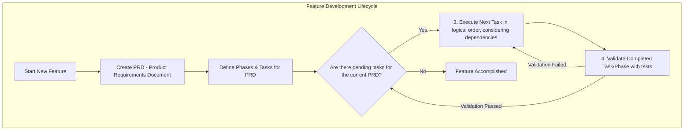

# System Flow for Feature Development

This document outlines the typical workflow used for developing new features.

## Workflow Diagram

The following Mermaid diagram visualizes the coordination of different stages in the development process:

## Explanation of "Accomplished"

In the context of this workflow:

- **Established Process:** The steps outlined (1 through 4) represent your defined and established process for tackling new features. This definition itself can be considered "accomplished."
- **Evidence in Practice:** Your project structure (e.g., the `tasks/react-kanban-ui-prd/` directory with its sub-phases) demonstrates that the initial stages of this workflow (creating a PRD and breaking it down into phases/tasks) are actively implemented for features.
- **Ongoing Activities:** Steps 3 (Execute Tasks) and 4 (Validate Phase/Task) are cyclical and ongoing for any feature currently in development.

This diagram serves as a review of how these "tools" (i.e., your process stages) coordinate to achieve the goal of completing a feature.

## Tool Correlation and Suggestions

This section correlates the workflow stages with existing tools, focusing on `VibePlannerTool` as defined in `src/server.ts` and `src/vibeplanner/index.ts`, and suggests potential complementary tools or enhancements.

**1. Start New Feature**

- **Existing Tools/Process:**
  - Initial ideas might originate from discussions or simple notes.
  - The formal process for a new feature within your tooling likely begins with `VibePlannerTool.startNewPlan`.
- **`VibePlannerTool` Role:**
  - `startNewPlan(name, description, sourceTool?)`: Initiates the creation of a new plan (PRD).
- **Potential Gaps/Suggestions:**
  - **Early-Stage Idea Management (if needed):** If `VibePlannerTool` is primarily for formalized PRDs, consider a lightweight system for capturing and discussing very early-stage ideas before they are committed to a plan (e.g., a shared document, a dedicated channel, or simple issue tracker features if not covered by `VibePlannerTool`'s scope).

**2. Create PRD (Product Requirements Document) & Define Phases & Tasks**

- **Existing Tools:**
  - **`VibePlannerTool`**: This is the core tool.
    - `startNewPlan()`: Creates the PRD and can return the `firstTask`. Relies on `PrdLifecycleService` for PRD management and `TaskOrchestrationService` / `PhaseControlService` for task and phase structure.
    - `getPlanStatus(planId)`: Retrieves the PRD details, including phases and tasks.
  - **`.cursorrules` (`planning-documents` rule):** Guides the _content and structure_ of the PRDs managed by `VibePlannerTool`.
  - **Markdown & Git:** PRD content generated based on the rule would likely be stored and versioned.
- **Potential Gaps/Suggestions:**
  - **Integration with PRD Documents:** If PRDs generated by the `planning-documents` rule are stored as separate markdown files, ensure clear linking or embedding mechanisms with the plans managed in `VibePlannerTool`.
  - **Formalized PRD Review Process (if not in VibePlannerTool):** If PRD approval is external to `VibePlannerTool`, ensure this process is clear (e.g., Git Pull Requests for markdown PRD files).

**3. Execute Next Task (in logical order, considering dependencies)**

- **Existing Tools:**
  - **`VibePlannerTool`**:
    - `getNextTask(planId)`: Fetches the next task to be worked on.
    - `updateTaskStatus(taskId, status, details?)`: To mark tasks as 'in_progress', 'blocked', etc.
  - **IDE:** (e.g., VS Code with Cursor).
  - **Languages/Frameworks:** TypeScript, React.
  - **Version Control:** Git.
  - **Package Manager:** Yarn.
  - **Build/Run Scripts:** In `package.json`.
- **Potential Gaps/Suggestions:**
  - **Continuous Integration (CI):**
    - **Tools:** GitHub Actions, GitLab CI, Jenkins.
    - **Benefits:** Automate builds, run tests, linting on every commit/PR. Essential for early issue detection.
  - **Pre-commit Hooks:** Use tools like Husky to run linters/formatters (e.g., ESLint, Prettier) before commits.

**4. Validate Completed Task/Phase (e.g., with tests)**

- **Existing Tools:**
  - **`VibePlannerTool`**:
    - `requestTaskValidation(taskId)`: Retrieves the `validationCommand` for a task.
    - `updateTaskStatus(taskId, status, details?)`: To mark tasks as 'completed', 'validated', 'failed', 'needs_review'. The `details` can include `validationOutput` and `exitCode`.
  - **Testing Framework:** Vitest (`vitest.config.ts`).
  - **Unit Test Structure:** `__tests__` directories.
  - **`planning-documents` rule:** Mandates a "Testing Strategy" in PRDs, guiding what to validate.
- **Potential Gaps/Suggestions:**
  - **Test Coverage Monitoring:**
    - **Tools:** Istanbul (often with Vitest), SonarQube.
    - **Benefits:** Ensure comprehensive test coverage.
  - **End-to-End (E2E) Testing:**
    - **Tools:** Cypress, Playwright.
    - **Benefits:** Test full user flows in the browser.
  - **Formalized Code Review Process:**
    - **Tools:** GitHub/GitLab Pull Requests with mandatory review policies.
  - **Static Analysis Security Testing (SAST) & Quality:**
    - **Tools:** SonarQube, CodeQL, Snyk.
    - **Benefits:** Find deeper bugs, security vulnerabilities, and code smells.
  - **CI Integration:** Run all tests, coverage checks, and static analysis as part of your CI pipeline, potentially feeding results back to `VibePlannerTool`'s task status.

This correlation aims to map your established workflow to tangible tools, highlighting `VibePlannerTool` as the central custom solution and suggesting areas for complementary tooling for automation and quality assurance.
