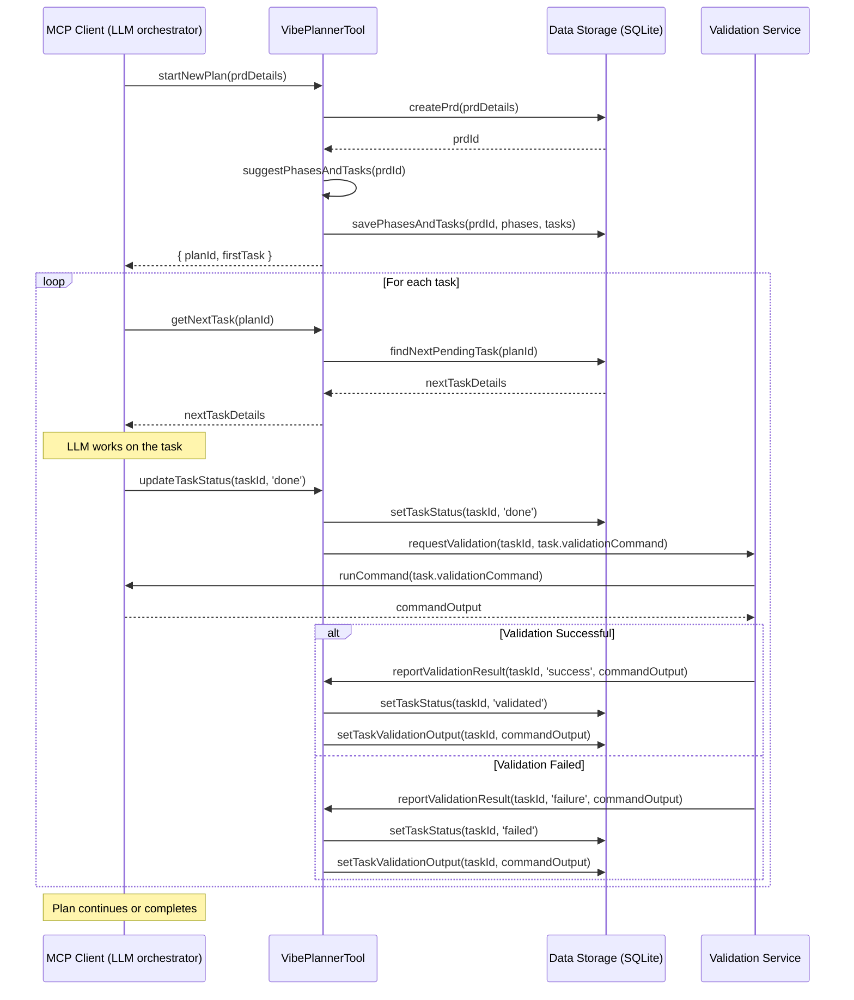

# VibePlanner: MCP Task Management System - Implementation Plan

🧠 Planning documents standards rule loaded!

## 1. Overview

- **Context & Goals**:
  - Develop an MCP (Model-Context-Protocol) tool, "VibePlanner," to manage and guide the LLM's workflow for feature development, bug fixing, or other coding tasks.
  - Ensure the LLM adheres to a structured plan, reducing derailment and improving the quality of generated code.
  - Provide a clear, iterative process with constant feedback loops, including automated checks after each task.
  - The system will manage Product Requirement Documents (PRDs), break them into phases, and further into actionable tasks.
- **Current Pain Points**:
  - LLMs in MCP clients can sometimes deviate from the primary goal.
  - Lack of a structured, verifiable task progression can lead to bugs or incomplete features.
  - Difficulty in tracking the LLM's progress against a defined plan.
  - Manual intervention is often needed to guide the LLM back on track.

## 2. Proposed Solution

- **High‑level Summary**:
  - VibePlanner will be an MCP tool that ingests a PRD (created via a `startPlanning` tool or similar mechanism).
  - It will then help define or suggest a series of phases (e.g., "Basic Setup," "Core Logic," "Advanced Features," "Testing & Refinement").
  - Each phase will consist of a list of specific, actionable tasks.
  - Tasks, phases, and PRDs will have statuses (e.g., `pending`, `ongoing`, `done`, `validated`, `needs_review`).
  - After each task completion (as reported by the MCP client/LLM), VibePlanner will prompt for validation steps (e.g., run tests, type checks, linting).
- **Architecture & Directory Structure (Revised)**:
  ```
  src/
  ├── vibeplanner/
  │   ├── index.ts                      # Main MCP Tool (VibePlannerTool entry point)
  │   ├── types.ts                      # Zod schemas and TypeScript types
  │   ├── services/                     # Business logic services for VibePlanner
  │   │   ├── PrdLifecycleService.ts    # Manages PRD creation, high-level state
  │   │   ├── PhaseControlService.ts    # Manages phase progression, status
  │   │   ├── TaskOrchestrationService.ts # Manages task details, status, execution flow
  │   │   └── DataPersistenceService.ts # Handles all DB interactions (SQLite)
  │   └── validation/
  │       └── index.ts                  # Logic for defining and interpreting validation steps
  ├── tools/                            # Existing MCP tools directory (e.g., startPlanning if it's a precursor)
  └── services/                         # General/shared services for the MCP application
      └── db.ts                         # SQLite database connection and setup
  ```

### 2.1. VibePlanner MCP Tool Interface

The primary interface for interacting with VibePlanner from an MCP client (e.g., an LLM agent) will be through the `VibePlannerTool`.

| Tool Name         | Description                                                           | Key Operations / MCP Interface Points                                                                                                                                                                                                                                                                                                                                                                                                                                                                                                                                                                                                                                                                                                                                                                                                                 |
| ----------------- | --------------------------------------------------------------------- | ----------------------------------------------------------------------------------------------------------------------------------------------------------------------------------------------------------------------------------------------------------------------------------------------------------------------------------------------------------------------------------------------------------------------------------------------------------------------------------------------------------------------------------------------------------------------------------------------------------------------------------------------------------------------------------------------------------------------------------------------------------------------------------------------------------------------------------------------------- |
| `VibePlannerTool` | The central MCP tool for creating, managing, and executing VibePlans. | - `startNewPlan(prdDetails: { name: string, description: string, sourceTool?: string })`: Initializes a new plan from PRD details. Returns `{ planId: string, firstTask?: Task }`. <br> - `getNextTask(planId: string): Task \| null`: Fetches the next actionable task. <br> - `updateTaskStatus(taskId: string, status: TaskStatus, details?: { validationOutput?: string, notes?: string })`: Updates a task's status and can include validation results or other notes. <br> - `requestTaskValidation(taskId: string): { validationCommand: string } \| null`: Retrieves the command needed to validate a task. The MCP client is expected to execute this command. <br> - `getPlanStatus(planId: string): PlanOverview`: Retrieves the current status of all phases and tasks in a plan (details of `PlanOverview` to be defined in `types.ts`). |

## 3. Implementation Plan

- **Phase 1: Core Data Structures & Storage (2 days)**

  1. Define Zod schemas and TypeScript types for PRD, Phase, Task, and `PlanOverview` in `src/vibeplanner/types.ts`. Include properties like `id`, `name`, `description`, `status`, `isValidated`, `dependencies`, `creationDate`, `completionDate`.
  2. Implement SQLite database connection setup in `src/services/db.ts` using `better-sqlite3`.
  3. Implement `src/vibeplanner/services/DataPersistenceService.ts` with functions for CRUD operations on PRDs, Phases, and Tasks, utilizing the `db.ts` connection.
  4. Unit tests for `DataPersistenceService.ts` functions.

- **Phase 2: PRD and Phase Lifecycle Management (2 days)**

  1. Implement `src/vibeplanner/services/PrdLifecycleService.ts` with logic to initialize a PRD (potentially from the output of a `startPlanning` tool or `startNewPlan` operation) and manage its overall lifecycle. This service will use `DataPersistenceService.ts`.
  2. Implement `src/vibeplanner/services/PhaseControlService.ts` to allow defining/managing phases for a PRD (manually or through LLM suggestion via the tool), and updating phase statuses. This service will use `DataPersistenceService.ts`.
  3. Functionality to add, update, and list phases associated with a PRD, managed through these services.
  4. Unit tests for `PrdLifecycleService.ts` and `PhaseControlService.ts`.

- **Phase 3: Task Orchestration (2.5 days)**

  1. Implement `src/vibeplanner/services/TaskOrchestrationService.ts` to manage tasks within phases, including adding new tasks, updating status (`pending`, `ongoing`, `done`), and determining the next task. This service will use `DataPersistenceService.ts`.
  2. Logic to mark tasks as `isValidated` based on feedback processed through the tool and this service.
  3. Ability to list tasks for a given phase, filter by status, managed through this service.
  4. Unit tests for `TaskOrchestrationService.ts`.

- **Phase 4: Validation & Feedback Loop (1.5 days)**

  1. Implement `src/vibeplanner/validation/index.ts` to define how validation commands are structured and how their results are interpreted.
  2. Integrate validation logic within `TaskOrchestrationService.ts`: when a task is marked `done`, this service, through `VibePlannerTool`, will expose `requestTaskValidation`. After the MCP client runs the command, `updateTaskStatus` will be called with results, which this service processes.
  3. Mechanism within `TaskOrchestrationService.ts` to receive and process validation results via `VibePlannerTool`'s methods, updating task/phase status accordingly (e.g. to `validated` or `failed`).

- **Phase 5: MCP Tool Integration (2 days)**

  1. Develop the main `VibePlannerTool` interface in `src/vibeplanner/index.ts`. This class will instantiate and use `PrdLifecycleService`, `PhaseControlService`, `TaskOrchestrationService`, and `DataPersistenceService` (potentially via dependency injection with `tsyringe`).
  2. Expose the defined operations (`startNewPlan`, `getNextTask`, etc.) and integrate with `@modelcontextprotocol/sdk`.
  3. Define how VibePlanner interacts with the MCP client based on the tool operations.
  4. Integration tests simulating MCP client interactions with `VibePlannerTool` methods, ensuring services are called correctly and data flows as expected.

- **Phase 6: UI/CLI (Optional - for debugging/local use) (1 day)**
  1. Simple CLI or interface to view and manage plans locally for easier development and debugging, interacting directly with the services if needed.

## 4. File and Directory Structures

```
cursor-tasklist-mcp/
├── docs/
│   └── vibeplanner-plan.md         # This planning document
├── src/
│   ├── vibeplanner/
│   │   ├── index.ts                # Main MCP Tool (VibePlannerTool entry point)
│   │   ├── types.ts                # Zod schemas & TS types (PRD, Phase, Task, PlanOverview)
│   │   ├── services/               # Business logic services
│   │   │   ├── PrdLifecycleService.ts
│   │   │   ├── PhaseControlService.ts
│   │   │   ├── TaskOrchestrationService.ts
│   │   │   └── DataPersistenceService.ts
│   │   └── validation/
│   │       └── index.ts            # Validation logic and interpretation
│   ├── constants/
│   │   └── index.ts
│   ├── services/                   # General/shared MCP application services
│   │   ├── __tests__/
│   │   └── db.ts                   # SQLite setup and connection manager
│   ├── tools/                      # Existing MCP tools directory
│   │   └── startVibePlan.ts        # (Consider if this is a distinct tool or covered by VibePlannerTool.startNewPlan)
│   └── server.ts                   # (If VibePlanner exposes any direct HTTP API, otherwise not primary)
├── .cursorrules
├── .gitignore
├── package.json
├── tsconfig.json
├── vitest.config.ts
└── yarn.lock
```

## 5. Technical Details

- **`src/vibeplanner/types.ts`**:

  ```typescript
  import { z } from 'zod';

  export const TaskStatusSchema = z.enum([
    'pending',
    'ongoing',
    'done',
    'failed',
    'validated',
    'needs_review',
  ]);
  export type TaskStatus = z.infer<typeof TaskStatusSchema>;

  export const PhaseStatusSchema = z.enum([
    'pending',
    'ongoing',
    'done',
    'validated',
    'failed', // Added failed state for phases too
  ]);
  export type PhaseStatus = z.infer<typeof PhaseStatusSchema>;

  export const TaskSchema = z.object({
    id: z.string().uuid(),
    name: z.string().min(1),
    description: z.string(),
    status: TaskStatusSchema.default('pending'),
    phaseId: z.string().uuid(),
    isValidated: z.boolean().default(false), // Potentially redundant if status includes 'validated'
    validationCommand: z.string().optional(), // e.g., "yarn test:unit some-spec.ts"
    validationOutput: z.string().optional(),
    notes: z.string().optional(),
    order: z.number().int().positive(),
    createdAt: z.date().default(() => new Date()),
    updatedAt: z.date().default(() => new Date()),
  });
  export type Task = z.infer<typeof TaskSchema>;

  export const PhaseSchema = z.object({
    id: z.string().uuid(),
    name: z.string().min(1),
    description: z.string().optional(),
    prdId: z.string().uuid(),
    status: PhaseStatusSchema.default('pending'),
    order: z.number().int().positive(),
    // Tasks will be managed by TaskOrchestrationService and DataPersistenceService based on phaseId
    // tasks: z.array(TaskSchema).default([]),
    createdAt: z.date().default(() => new Date()),
    updatedAt: z.date().default(() => new Date()),
  });
  export type Phase = z.infer<typeof PhaseSchema>;

  export const PrdSchema = z.object({
    id: z.string().uuid(),
    name: z.string().min(1),
    description: z.string(), // Base plan (feature/bugfix)
    sourceTool: z.string().optional(), // e.g., 'startPlanning'
    status: PhaseStatusSchema.default('pending'), // Overall status
    // Phases will be managed by PhaseControlService and DataPersistenceService based on prdId
    // phases: z.array(PhaseSchema).default([]),
    createdAt: z.date().default(() => new Date()),
    updatedAt: z.date().default(() => new Date()),
  });
  export type Prd = z.infer<typeof PrdSchema>;

  // For getPlanStatus operation
  export const PlanOverviewSchema = z.object({
    prd: PrdSchema,
    phases: z.array(PhaseSchema.extend({ tasks: z.array(TaskSchema) })), // Embed tasks within phases for overview
  });
  export type PlanOverview = z.infer<typeof PlanOverviewSchema>;
  ```

- **`src/services/db.ts`** (Connection setup. For detailed schema and DDL, see `docs/database-schema.md`):

  ```typescript
  // Example using better-sqlite3
  import Database from 'better-sqlite3';
  import path from 'path';

  // Could be configured via environment variable or MCP settings
  const dbPath =
    process.env.NODE_ENV === 'test'
      ? ':memory:'
      : path.join(process.cwd(), 'vibeplanner.db'); // Ensure path is relative to project root

  // Ensure the directory exists if it's not in-memory
  if (process.env.NODE_ENV !== 'test') {
    const dbDir = path.dirname(dbPath);
    // fs.mkdirSync(dbDir, { recursive: true }); // This would need import fs, handle carefully
  }

  export const db = new Database(dbPath, {
    /* verbose: console.log */
  });

  // Schema initialization (run once, e.g., on app start or via a dedicated setup script).
  // The actual DDL statements are maintained in 'docs/database-schema.md'.
  export function initializeSchema() {
    // This function would read the DDL from 'docs/database-schema.md' or have it hardcoded/imported,
    // and then execute it using db.exec().
    // For example (conceptual, actual DDL is in the .md file):
    const ddl = `
      CREATE TABLE IF NOT EXISTS prds (id TEXT PRIMARY KEY, name TEXT); 
      /* ... more DDL ... */
    `; // Load or copy DDL from docs/database-schema.md
    db.exec(ddl);
    console.log(
      'Database schema initialized based on docs/database-schema.md.'
    );
  }

  // Consider calling initializeSchema() from a main application setup point,
  // not directly on module load if this db.ts is imported in multiple places
  // during a single application lifecycle (e.g. tests vs. app).
  // For an MCP tool, this might be done when the tool itself is initialized.
  // initializeSchema();
  ```

- **`src/vibeplanner/index.ts` (VibePlannerTool - Skeleton)**:

  ```typescript
  import { type McpTool, type McpToolContext } from '@modelcontextprotocol/sdk';
  import { container } from 'tsyringe'; // Assuming tsyringe is set up for DI
  import { PrdLifecycleService } from './services/PrdLifecycleService';
  import { PhaseControlService } from './services/PhaseControlService';
  import { TaskOrchestrationService } from './services/TaskOrchestrationService';
  // import { DataPersistenceService } from './services/DataPersistenceService'; // Services use this directly
  import { initializeSchema } from '../../services/db'; // Path to the top-level db.ts
  import type { Task, TaskStatus, PlanOverview } from './types'; // Ensure types are imported

  export class VibePlannerTool implements McpTool {
    private prdService: PrdLifecycleService;
    private phaseService: PhaseControlService;
    private taskService: TaskOrchestrationService;

    constructor() {
      // Initialize schema once when the tool is constructed, or ensure it's done by the application
      // This is a simplistic approach; a more robust app would handle DB init separately.
      initializeSchema();

      // Resolve services using tsyringe or instantiate directly
      this.prdService = container.resolve(PrdLifecycleService);
      this.phaseService = container.resolve(PhaseControlService);
      this.taskService = container.resolve(TaskOrchestrationService);
      // DataPersistenceService would be injected into the above services by tsyringe
    }

    async startNewPlan(
      context: McpToolContext,
      prdDetails: { name: string; description: string; sourceTool?: string }
    ): Promise<{ planId: string; firstTask?: Task }> {
      const planId = await this.prdService.initializePrd(prdDetails);
      // Optionally, fetch the first task of the newly created plan
      const firstTask = await this.taskService.getNextTaskForPlan(planId);
      return { planId, firstTask };
    }

    async getCurrentPlanStatus(
      context: McpToolContext,
      planId: string
    ): Promise<PlanOverview | null> {
      // This method was named getPlanStatus in the table, aligning here.
      // Implementation would involve fetching PRD, then its phases, then tasks for each phase.
      // PrdLifecycleService, PhaseControlService, TaskOrchestrationService would be used.
      const prd = await this.prdService.getPrd(planId);
      if (!prd) return null;
      const phasesWithTasks = await this.phaseService.getPhasesWithTasks(
        planId
      );
      return { prd, phases: phasesWithTasks };
    }

    // Alias for clarity if needed, or stick to one name.
    async getPlanStatus(
      context: McpToolContext,
      planId: string
    ): Promise<PlanOverview | null> {
      return this.getCurrentPlanStatus(context, planId);
    }

    async getNextTask(
      context: McpToolContext,
      planId: string
    ): Promise<Task | null> {
      return this.taskService.getNextTaskForPlan(planId);
    }

    async updateTaskStatus(
      context: McpToolContext,
      taskId: string,
      status: TaskStatus,
      details?: { validationOutput?: string; notes?: string }
    ): Promise<void> {
      await this.taskService.updateTask(taskId, {
        status,
        validationOutput: details?.validationOutput,
        notes: details?.notes,
      });
      // Potentially trigger phase/PRD status updates if a task completion leads to phase completion etc.
      // This logic could reside in TaskOrchestrationService or be coordinated here.
    }

    async requestTaskValidation(
      context: McpToolContext,
      taskId: string
    ): Promise<{ validationCommand: string } | null> {
      const task = await this.taskService.getTask(taskId);
      if (task && task.validationCommand) {
        return { validationCommand: task.validationCommand };
      }
      return null;
    }
  }
  ```

## 6. Usage Examples

1.  **MCP Client initiates a new plan for a feature**:

    ```javascript
    // MCP Client Side (conceptual)
    const vibePlanner = client.getTool('VibePlannerTool');
    const plan = await vibePlanner.startNewPlan({
      name: 'Implement User Authentication',
      description: 'Add email/password login and registration.',
    });
    console.log('New plan started:', plan.planId);
    let nextTask = await vibePlanner.getNextTask(plan.planId);
    ```

2.  **LLM completes a task and reports back**:

    ```javascript
    // LLM / MCP Client orchestrator
    // ... LLM performs coding for nextTask.description ...
    // Assume nextTask.id is 'task-123' and nextTask.validationCommand is 'yarn test:auth'

    await vibePlanner.updateTaskStatus('task-123', 'done');
    // VibePlanner internally might trigger validation:
    // context.runShellCommand('yarn test:auth')
    // Then, based on result:
    // await vibePlanner.updateTaskStatus('task-123', 'validated', 'All tests passed.');
    // OR
    // await vibePlanner.updateTaskStatus('task-123', 'failed', 'Login test failed: ...');

    nextTask = await vibePlanner.getNextTask(plan.planId);
    ```

## 7. Testing Strategy

- **Unit Tests (Vitest)**:
  - `DataPersistenceService.ts`: CRUD operations for PRDs, Phases, Tasks. Test edge cases.
  - `PrdLifecycleService.ts`, `PhaseControlService.ts`, `TaskOrchestrationService.ts`: Business logic for each service. Mock `DataPersistenceService` to isolate logic.
  - `types.ts`: Zod schema validation.
  - `validation/index.ts`: Logic for constructing and interpreting validation commands/results.
- **Integration Tests (Vitest)**:
  - Test the interaction between business logic services (`PrdLifecycleService`, etc.) and `DataPersistenceService.ts` using an in-memory SQLite database.
  - Simulate MCP client interactions with `VibePlannerTool` methods, ensuring services are called correctly and data flows through the layers as expected.
  - Test the validation feedback loop: task done -> validation requested (via `VibePlannerTool`) -> (MCP client simulates command execution) -> `updateTaskStatus` called with results -> task status updated in DB.

## 8. Edge Cases

| Edge Case                                          | Remediation                                                                                                                               |
| :------------------------------------------------- | :---------------------------------------------------------------------------------------------------------------------------------------- |
| MCP client provides invalid PRD data               | Use Zod schemas for strict validation at the entry point of `startNewPlan`. Return clear error messages.                                  |
| Validation command fails (e.g., test script error) | Mark task as `failed` or `needs_review`. Store error output. Allow re-running validation or manual override.                              |
| LLM gets stuck on a task                           | Implement a timeout or retry mechanism for tasks. Allow manual skipping or re-phrasing of a task by the operator.                         |
| Dependent tasks are blocked                        | Clearly define task dependencies. Prevent starting a task if its dependencies are not `validated`.                                        |
| SQLite database corruption/error                   | Implement error handling for DB operations. Log errors. Consider backup/restore mechanisms if data is critical and long-lived.            |
| MCP environment doesn't support `better-sqlite3`   | Research alternative Node.js SQLite libraries compatible with the MCP environment or use an in-memory store for simpler, transient plans. |
| LLM provides partial completion of a task          | Task descriptions should be granular. If still too large, allow breaking down tasks further or have a `partially_completed` status.       |

## 9. Sequence Diagram



## 10. Risks & Mitigations

| Risk                                                     | Mitigation                                                                                                                               |
| :------------------------------------------------------- | :--------------------------------------------------------------------------------------------------------------------------------------- |
| Overly complex plan becomes hard for LLM to follow       | Encourage granular tasks. Allow dynamic adjustments to the plan. Provide clear "next step" guidance.                                     |
| Validation steps are too slow, hindering iteration speed | Optimize validation commands. Allow skipping non-critical validations in dev mode. Provide clear feedback on validation progress.        |
| Scope creep within a PRD                                 | PRDs should be well-defined. VibePlanner focuses on executing the given PRD, not expanding it. New requirements lead to new PRDs/Phases. |
| Data persistence issues with SQLite in diverse MCP envs  | Thoroughly test SQLite compatibility. Offer an in-memory fallback or alternative simpler storage if SQLite proves problematic.           |
| LLM misinterprets task descriptions                      | Use clear, concise, and actionable language for task descriptions. Allow for human clarification or re-phrasing of tasks.                |
| Difficulty in debugging VibePlanner state                | Implement robust logging. The optional CLI/UI (Phase 6) can help inspect current plan state during development.                          |

## 11. Timeline

- **Total Estimated Time**: 11 days (excluding optional Phase 6)
- **Breakdown**:
  - Phase 1: Core Data Structures & Storage: 2 days
  - Phase 2: PRD and Phase Lifecycle Management: 2 days
  - Phase 3: Task Orchestration: 2.5 days
  - Phase 4: Validation & Feedback Loop: 1.5 days
  - Phase 5: MCP Tool Integration: 2 days
  - Phase 6 (Optional): UI/CLI: 1 day

## 12. Acceptance Criteria

- A new PRD can be created in VibePlanner, either from a `startPlanning` like tool or direct input.
- PRDs can be broken down into multiple phases, and phases into multiple tasks.
- Each task has a defined status (`pending`, `ongoing`, `done`, `validated`, `failed`, `needs_review`).
- After a task is marked `done` by the LLM/MCP client, VibePlanner can request a validation step (e.g., run tests via MCP context).
- Based on validation results, task status is updated to `validated` or `failed`.
- The MCP client can query VibePlanner for the current plan status and the next actionable task.
- All data (PRDs, Phases, Tasks) is persisted using SQLite (e.g., `better-sqlite3`).
- Core logic is covered by unit tests.
- Key interaction flows are covered by integration tests.
- The system gracefully handles common error conditions (e.g., validation failures, invalid input).

## 13. Conclusion

VibePlanner aims to be a critical MCP tool for standardizing and guiding LLM-driven development workflows. By introducing a structured approach with PRDs, phases, tasks, and integrated validation, it will enhance reliability, reduce deviations, and improve the overall quality of outcomes from MCP clients. The iterative nature with constant feedback ensures that the LLM stays on track and potential issues are caught early. Next steps involve starting with Phase 1: Core Data Structures & Storage.

## 14. Assumptions & Dependencies

- **MCP Environment**: Assumes an MCP client environment capable of:
  - Executing TypeScript/JavaScript-based tools.
  - Running shell commands for validation steps (tests, linters, type checks).
  - Interacting with tools via a defined SDK (`@modelcontextprotocol/sdk`).
- **Node.js Version**: Compatible with the project's current Node.js version (as per `package.json` and `tsconfig.json`).
- **TypeScript**: Project uses TypeScript. VibePlanner will be written in TypeScript.
- **Dependency Injection**: `tsyringe` will be used for managing dependencies within VibePlanner services.
- **Schema Validation**: `zod` will be used for defining and validating data structures.
- **Database**:
  - `better-sqlite3` (or a similar Node.js SQLite library) will be used for local data persistence.
  - Assumes the MCP client environment allows file system access for the SQLite database file or can work with an in-memory database if configured.
- **Testing Framework**: `vitest` for unit and integration tests.
- **`startPlanning` Tool**: Assumes a mechanism (e.g., an existing MCP tool named `startPlanning` or similar) exists or will be created to generate the initial PRD content that VibePlanner will consume. If not, the scope of VibePlanner might need to include PRD creation guidance.
- **LLM Capabilities**: Assumes the LLM interacting with VibePlanner can understand task descriptions, report progress, and provide context for validation failures.
